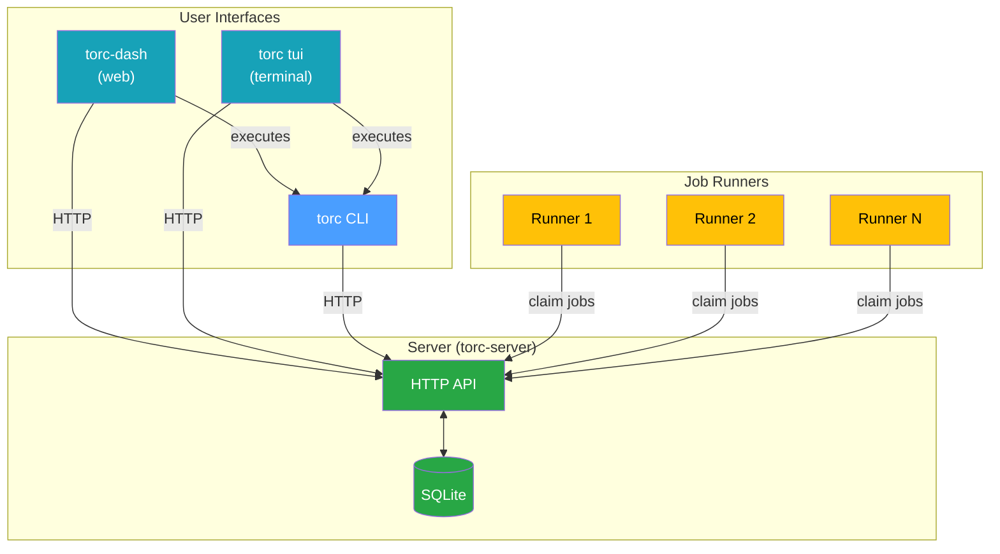

# Architecture

## Overview

Torc uses a client-server architecture where a central server manages workflow state and
coordination, while clients create workflows and job runners execute tasks on compute resources.

**Key Components:**

| Component      | Description                                                                  |
| -------------- | ---------------------------------------------------------------------------- |
| **torc-dash**  | Web dashboard for visual workflow management                                 |
| **torc tui**   | Terminal UI for monitoring in SSH environments                               |
| **torc CLI**   | Command-line tool for all workflow operations                                |
| **Server**     | HTTP API service that manages workflow state via SQLite                      |
| **Job Runner** | Worker process that polls for ready jobs, executes them, and reports results |
