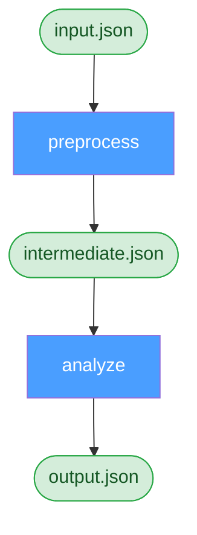

# Dependency Resolution

Torc supports two types of dependencies: **explicit** (declared via `depends_on`) and **implicit**
(inferred from file/data relationships). For a hands-on tutorial, see
[Diamond Workflow with File Dependencies](../tutorials/diamond.md).

## Explicit Dependencies

Declared via `depends_on`:

```yaml
jobs:
  - name: preprocess
    command: preprocess.sh
  - name: analyze
    command: analyze.sh
    depends_on:
      - preprocess
```

## Implicit Dependencies via Files

Torc automatically infers dependencies from file relationships. When one job outputs a file and
another job inputs it, the dependency is created automatically:

```yaml
jobs:
  - name: preprocess
    command: "preprocess.sh -o ${files.output.intermediate}"
  - name: analyze
    command: "analyze.sh -i ${files.input.intermediate}"

files:
  - name: intermediate
    path: data/intermediate.json
```

This creates a diamond workflow pattern:



No explicit `depends_on` needed — Torc infers that `analyze` depends on `preprocess` because they
share the `intermediate` file.

## Implicit Dependencies via User Data

User data works like files but stores JSON in the database instead of the filesystem:

```yaml
jobs:
  - name: generate_config
    command: |
      torc user-data update ${user_data.output.config} --data '{"lr": 0.001}'
  - name: run_simulation
    command: |
      CONFIG=$(torc user-data get ${user_data.input.config} | jq '.data')
      python simulate.py --config "$CONFIG"

user_data:
  - name: config
```


Use user data for small configuration objects; use files for large datasets.

## Resolution Process

During workflow creation, the server:

1. Resolves all names to IDs
2. Stores explicit dependencies in `job_depends_on`
3. Stores file/user_data relationships in junction tables
4. During `initialize_jobs`, queries junction tables to add implicit dependencies

## Dependency Graph Evaluation

When `initialize` is called:

1. All jobs start in `uninitialized` state
2. Server builds complete dependency graph from explicit and implicit dependencies
3. Jobs with no unsatisfied dependencies are marked `ready`
4. Jobs waiting on dependencies are marked `blocked`
5. As jobs complete, blocked jobs are re-evaluated and may become `ready`

## Variable Substitution Syntax

In workflow specification files (YAML, JSON5, KDL), use these patterns to reference files and user
data in job commands:

| Pattern                    | Description                                            |
| -------------------------- | ------------------------------------------------------ |
| `${files.input.NAME}`      | File path this job reads (creates implicit dependency) |
| `${files.output.NAME}`     | File path this job writes (satisfies dependencies)     |
| `${user_data.input.NAME}`  | User data this job reads                               |
| `${user_data.output.NAME}` | User data this job writes                              |

Example:

```yaml
jobs:
  - name: process
    command: "python process.py -i ${files.input.raw} -o ${files.output.result}"
```

See [Workflow Specification Formats](../workflows/workflow-formats.md) for complete syntax details.
