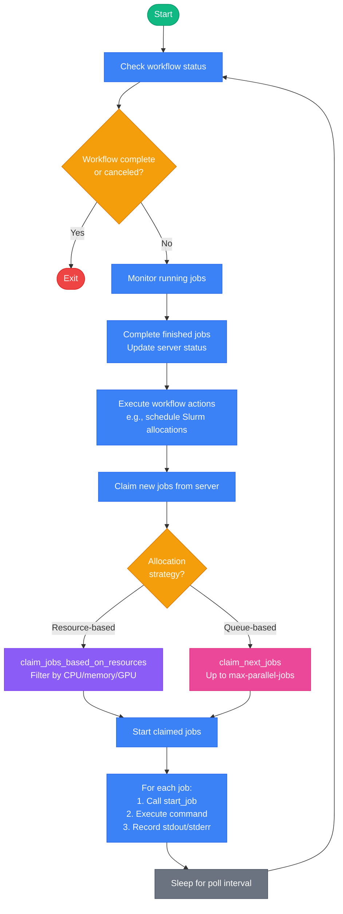

# Job Runners

Job runners are worker processes that execute jobs on compute resources.

## Job Runner Modes

Torc supports three execution modes:

1. **Local Runner** (`torc run`) - Runs jobs on the local machine with resource tracking
2. **HPC/Slurm Runner** (`torc submit-slurm`) - Runs jobs on Slurm-allocated compute nodes
3. **Remote Workers** (`torc remote run`) - Distributes jobs across SSH-accessible machines

### Local Runner

The local runner executes jobs directly on the current machine. Start it with:

```console
torc run <workflow-id>
```

### HPC/Slurm Runner

For HPC clusters, jobs run on Slurm-allocated compute nodes. The `torc-slurm-job-runner` binary is
launched by Slurm on each allocated node and polls the server for work.

### Remote Workers

Remote workers enable distributed execution without a scheduler. The `torc remote run` command
SSH-es into multiple machines and starts a `torc run` process on each:

```console
torc remote run workers.txt <workflow-id>
```

Each remote worker runs as a detached process and polls the server for jobs, just like the local
runner. The server coordinates job distribution to prevent double-allocation.

## Job Allocation Strategies

The job runner supports two different strategies for retrieving and executing jobs:

### Resource-Based Allocation (Default)

**Used when**: `--max-parallel-jobs` is NOT specified

**Behavior**:

- Retrieves jobs from the server via the command `claim_jobs_based_on_resources`
- Server filters jobs based on available compute node resources (CPU, memory, GPU)
- Only returns jobs that fit within the current resource capacity
- Prevents resource over-subscription and ensures jobs have required resources
- Defaults to requiring one CPU and 1 MB of memory for each job.

**Use cases**:

- When you want parallelization based on one CPU per job.
- When you have heterogeneous jobs with different resource requirements and want intelligent
  resource management.

**Example 1: Run jobs at queue depth of num_cpus**:

```yaml
parameters:
  i: "1:100"
jobs:
  - name: "work_{i}"
    command: bash my_script.sh {i}
    use_parameters:
    - i
```

**Example 2: Resource-based parallelization**:

```yaml
resource_requirements:
  - name: "work_resources"
    num_cpus: 32
    memory: "200g"
    runtime: "PT4H"
    num_nodes: 1
    
parameters:
  i: "1:100"
jobs:
  - name: "work_{i}"
    command: bash my_script.sh {i}
    resource_requirements: work_resources  
    use_parameters:
    - i
```

### Simple Queue-Based Allocation

**Used when**: `--max-parallel-jobs` is specified

**Behavior**:

- Retrieves jobs from the server via the command `claim_next_jobs`
- Server returns the next N ready jobs from the queue (up to the specified limit)
- Ignores job resource requirements completely
- Simply limits the number of concurrent jobs

**Use cases**: When all jobs have similar resource needs or when the resource bottleneck is not
tracked by Torc, such as network or storage I/O. This is the only way to run jobs at a queue depth
higher than the number of CPUs in the worker.

**Example**:

```bash
torc run $WORKFLOW_ID \
  --max-parallel-jobs 10 \
  --output-dir ./results
```

## Job Runner Workflow

The job runner executes a continuous loop with these steps:



1. **Check workflow status** - Poll server to check if workflow is complete or canceled
2. **Monitor running jobs** - Check status of currently executing jobs
3. **Execute workflow actions** - Check for and execute any pending workflow actions, such as
   scheduling new Slurm allocations.
4. **Claim new jobs** - Request ready jobs from server based on allocation strategy:
   - Resource-based: `claim_jobs_based_on_resources`
   - Queue-based: `claim_next_jobs`
5. **Start jobs** - For each claimed job:
   - Call `start_job` to mark job as started in database
   - Execute job command in a non-blocking subprocess
   - Record stdout/stderr output to files
6. **Complete jobs** - When running jobs finish:
   - Call `complete_job` with exit code and result
   - Server updates job status and automatically marks dependent jobs as ready
7. **Sleep and repeat** - Wait for job completion poll interval, then repeat loop

The runner continues until the workflow is complete or canceled.

## Resource Management (Resource-Based Allocation Only)

When using resource-based allocation (default), the local job runner tracks:

- Number of CPUs in use
- Memory allocated to running jobs
- GPUs in use
- Job runtime limits

When a ready job is retrieved, the runner checks if sufficient resources are available before
executing it.
