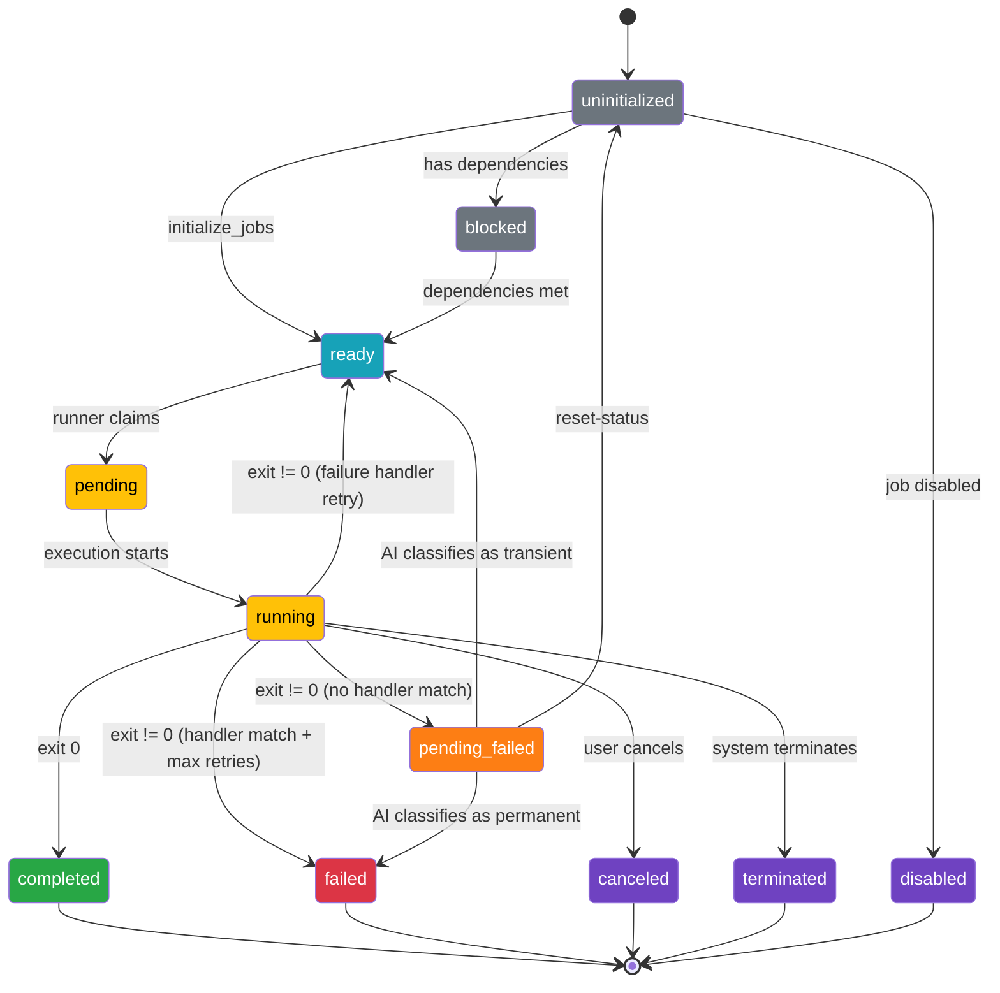

# Job State Transitions

Jobs progress through a defined lifecycle:

## State Descriptions

- **uninitialized** (0) - Job created but dependencies not evaluated
- **blocked** (1) - Waiting for dependencies to complete
- **ready** (2) - All dependencies satisfied, ready for execution
- **pending** (3) - Job claimed by runner
- **running** (4) - Currently executing
- **completed** (5) - Finished successfully (exit code 0)
- **failed** (6) - Finished with error (exit code != 0)
- **canceled** (7) - Explicitly canceled by user or torc. Never executed.
- **terminated** (8) - Explicitly terminated by system, such as at wall-time timeout
- **disabled** (9) - Job is disabled and will not run
- **pending_failed** (10) - Job failed without a matching failure handler. Awaiting AI-assisted
  classification to determine if the error is transient (retry) or permanent (fail). See
  [AI-Assisted Recovery](../specialized/fault-tolerance/ai-assisted-recovery.md).
