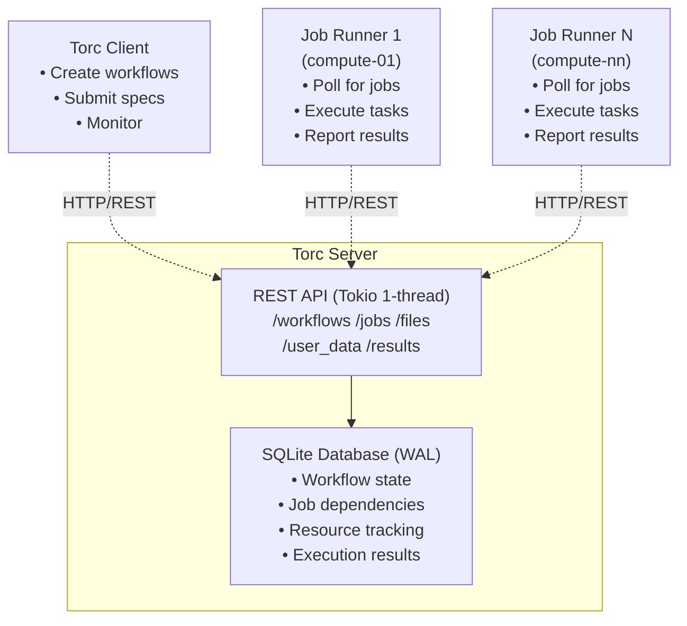

# Architecture

## Overview

Torc uses a client-server architecture where a central server manages workflow state and coordination, while clients create workflows and job runners execute tasks on compute resources.

**Key Components:**

- **Server**: REST API service that manages workflow state via a SQLite database
- **Client**: CLI tool and library for creating and managing workflows
- **Job Runner**: Worker process that pulls ready jobs, executes them, and reports results
- **Database**: Central SQLite database that stores all workflow state and coordinates distributed execution

## System Diagram

