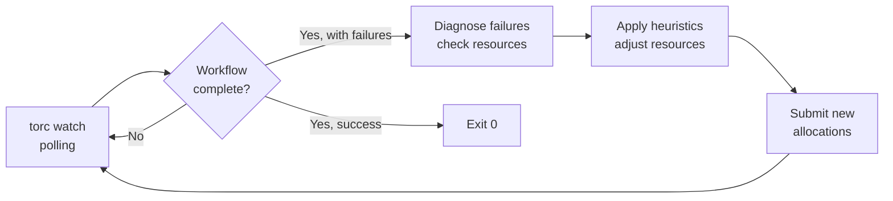

# Automatic Failure Recovery

This document explains how Torc's automatic failure recovery system works, its design principles,
and when to use automatic vs manual recovery.

## Overview

Torc provides **automatic failure recovery** through the `torc watch --auto-recover` command. When
jobs fail, the system:

1. Diagnoses the failure cause (OOM, timeout, or unknown)
2. Applies heuristics to adjust resource requirements
3. Resets failed jobs and submits new Slurm allocations
4. Resumes monitoring until completion or max retries

This deterministic approach handles the majority of HPC failures without human intervention.

## Design Principles

### Why Deterministic Recovery?

Most HPC job failures fall into predictable categories:

| Failure Type     | Frequency | Solution                   |
| ---------------- | --------- | -------------------------- |
| Out of Memory    | ~60%      | Increase memory allocation |
| Timeout          | ~25%      | Increase runtime limit     |
| Transient errors | ~10%      | Simple retry               |
| Code bugs        | ~5%       | Manual intervention        |

For 85-90% of failures, the solution is mechanical: increase resources and retry. This doesn't
require AI judgment—simple heuristics work well.

### Recovery Architecture



### Failure Detection

Torc tracks resource usage during job execution:

- Memory usage (RSS and peak)
- CPU utilization
- Execution time

This data is analyzed to determine failure causes:

**OOM Detection:**

- Peak memory exceeds specified limit
- Exit code 137 (SIGKILL from OOM killer)
- Flag: `likely_oom: true`

**Timeout Detection:**

- Execution time within 10% of runtime limit
- Job was killed (not graceful exit)
- Flag: `likely_timeout: true`

### Recovery Heuristics

Default multipliers applied to failed jobs:

| Failure | Default Multiplier | Configurable           |
| ------- | ------------------ | ---------------------- |
| OOM     | 1.5x memory        | `--memory-multiplier`  |
| Timeout | 1.5x runtime       | `--runtime-multiplier` |

Example: A job with 8g memory that fails with OOM gets 12g on retry.

### Slurm Scheduler Regeneration

After adjusting resources, the system regenerates Slurm schedulers:

1. Finds all pending jobs (uninitialized, ready, blocked)
2. Groups by resource requirements
3. Calculates minimum allocations needed
4. Creates new schedulers with appropriate walltimes
5. Submits allocations to Slurm

This is handled by `torc slurm regenerate --submit`.

## Configuration

### Command-Line Options

```bash
torc watch <workflow_id> \
  --auto-recover \              # Enable automatic recovery
  --max-retries 3 \             # Maximum recovery attempts
  --memory-multiplier 1.5 \     # Memory increase factor for OOM
  --runtime-multiplier 1.5 \    # Runtime increase factor for timeout
  --poll-interval 60 \          # Seconds between status checks
  --output-dir output \         # Directory for job output files
  --show-job-counts             # Display job counts during polling (optional)
```

### Retry Limits

The `--max-retries` option prevents infinite retry loops. After exceeding this limit, the system
exits with an error, indicating manual intervention is needed.

Default: 3 retries

## When to Use Manual Recovery

Automatic recovery works well for resource-related failures, but some situations require manual
intervention:

### Use Manual Recovery When:

1. **Jobs keep failing after max retries**
   - The heuristics aren't solving the problem
   - Need to investigate root cause

2. **Unknown failure modes**
   - Exit codes that don't indicate OOM/timeout
   - Application-specific errors

3. **Code bugs**
   - Jobs fail consistently with same error
   - No resource issue detected

4. **Cost optimization**
   - Want to analyze actual usage before increasing
   - Need to decide whether job is worth more resources

### MCP Server for Manual Recovery

The Torc MCP server provides tools for AI-assisted investigation:

| Tool                         | Purpose                          |
| ---------------------------- | -------------------------------- |
| `get_workflow_status`        | Get overall workflow status      |
| `list_failed_jobs`           | List failed jobs with error info |
| `get_job_logs`               | Read stdout/stderr logs          |
| `check_resource_utilization` | Detailed resource analysis       |
| `update_job_resources`       | Manually adjust resources        |
| `resubmit_workflow`          | Regenerate Slurm schedulers      |

## Comparison

| Feature                | Automatic            | Manual/AI-Assisted      |
| ---------------------- | -------------------- | ----------------------- |
| Human involvement      | None                 | Interactive             |
| Speed                  | Fast                 | Depends on human        |
| Handles OOM/timeout    | Yes                  | Yes                     |
| Handles unknown errors | Retry only           | Full investigation      |
| Cost optimization      | Basic                | Can be sophisticated    |
| Use case               | Production workflows | Debugging, optimization |

## Implementation Details

### The Watch Command

```bash
torc watch <workflow_id> --auto-recover
```

Main loop:

1. Poll `is_workflow_complete` API
2. Print status updates
3. On completion, check for failures
4. If failures and auto-recover enabled:
   - Run `torc reports check-resource-utilization --include-failed`
   - Parse results for `likely_oom` and `likely_timeout` flags
   - Update resource requirements via API
   - Run `torc workflows reset-status --failed-only --reinitialize`
   - Run `torc slurm regenerate --submit`
   - Increment retry counter
   - Resume polling
5. Exit 0 on success, exit 1 on max retries exceeded

### The Regenerate Command

```bash
torc slurm regenerate <workflow_id> --submit
```

1. Query jobs with status uninitialized/ready/blocked
2. Group by resource requirements
3. For each group:
   - Find best partition using HPC profile
   - Calculate jobs per node
   - Determine number of allocations needed
   - Create scheduler config
4. Update jobs with new scheduler reference
5. Submit allocations via sbatch

## See Also

- [Automatic Failure Recovery Tutorial](../tutorials/automatic-recovery.md) - Step-by-step guide
- [MCP Server Tutorial](../tutorials/mcp-server.md) - Setting up AI-assisted tools
- [Resource Monitoring](../how-to/resource-monitoring.md) - Understanding resource tracking
