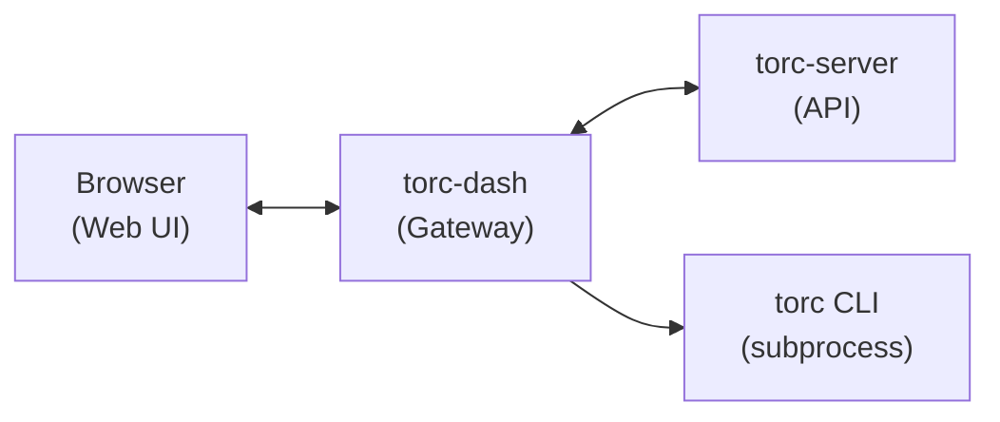

# Web Dashboard (torc-dash)

The `torc-dash` application is a web gateway that provides a browser-based UI for managing Torc workflows. It bridges a web frontend with the torc ecosystem by proxying API requests and executing CLI commands.

## Architecture



The dashboard acts as a gateway layer that:

1. **Serves embedded static assets** - HTML, CSS, and JavaScript bundled into the binary
2. **Proxies API requests** - Forwards `/torc-service/*` requests to a remote torc-server
3. **Executes CLI commands** - Runs `torc` CLI as subprocesses for complex operations
4. **Manages server lifecycle** - Optionally spawns and manages a torc-server instance

## Core Components

### Embedded Static Assets

Uses the `rust_embed` crate to bundle all files from the `static/` directory directly into the binary at compile time:

```rust
#[derive(Embed)]
#[folder = "static/"]
struct Assets;
```

This enables single-binary deployment with no external file dependencies.

### Application State

Shared state across all request handlers:

```rust
struct AppState {
    api_url: String,           // Remote torc-server URL
    client: reqwest::Client,   // HTTP client for proxying
    torc_bin: String,          // Path to torc CLI binary
    torc_server_bin: String,   // Path to torc-server binary
    managed_server: Mutex<ManagedServer>,  // Optional embedded server state
}
```

### Standalone Mode

When launched with `--standalone`, torc-dash automatically spawns a `torc-server` subprocess:

1. Starts torc-server with configurable port (0 for auto-detection)
2. Reads `TORC_SERVER_PORT=<port>` from stdout to discover actual port
3. Configures API URL to point to the managed server
4. Tracks process ID for lifecycle management

This enables single-command deployment for local development or simple production setups.

## Request Routing

### Static File Routes

| Route | Handler | Purpose |
|-------|---------|---------|
| `/` | `index_handler` | Serves `index.html` |
| `/static/*` | `static_handler` | Serves embedded assets with MIME types |

### API Proxy

All `/torc-service/*` requests are transparently proxied to the remote torc-server:

```
Browser: GET /torc-service/v1/workflows
    ↓
torc-dash: forwards to http://localhost:8080/torc-service/v1/workflows
    ↓
torc-server: responds with workflow list
    ↓
torc-dash: returns response to browser
```

The proxy preserves HTTP methods (GET, POST, PUT, PATCH, DELETE), headers, and request bodies.

### CLI Command Endpoints

These endpoints execute the `torc` CLI as subprocesses, enabling operations that require local file access or complex orchestration:

| Endpoint | CLI Command | Purpose |
|----------|-------------|---------|
| `POST /api/cli/create` | `torc workflows create` | Create workflow from spec file |
| `POST /api/cli/run` | `torc workflows run` | Run workflow locally |
| `POST /api/cli/submit` | `torc workflows submit` | Submit to scheduler |
| `POST /api/cli/initialize` | `torc workflows initialize` | Initialize job dependencies |
| `POST /api/cli/delete` | `torc workflows delete` | Delete workflow |
| `POST /api/cli/reinitialize` | `torc workflows reinitialize` | Reinitialize workflow |
| `POST /api/cli/reset-status` | `torc workflows reset-status` | Reset job statuses |
| `GET /api/cli/run-stream` | `torc workflows run` | SSE streaming execution |

### Server Management Endpoints

| Endpoint | Purpose |
|----------|---------|
| `POST /api/server/start` | Start a managed torc-server |
| `POST /api/server/stop` | Stop the managed server |
| `GET /api/server/status` | Check server running status |

### Utility Endpoints

| Endpoint | Purpose |
|----------|---------|
| `POST /api/cli/read-file` | Read local file contents |
| `POST /api/cli/plot-resources` | Generate resource plots from DB |
| `POST /api/cli/list-resource-dbs` | Find resource database files |

## Key Features

### Streaming Workflow Execution

The `/api/cli/run-stream` endpoint uses Server-Sent Events (SSE) to provide real-time feedback:

```
Event: start
Data: Running workflow abc123

Event: stdout
Data: Job job_1 started

Event: status
Data: Jobs: 3 running, 7 completed (total: 10)

Event: stdout
Data: Job job_1 completed

Event: end
Data: success

Event: exit_code
Data: 0
```

The stream includes:
- **stdout/stderr** from the torc CLI process
- **Periodic status updates** fetched from the API every 3 seconds
- **Exit code** when the process completes

### CLI Execution Pattern

All CLI commands follow a consistent execution pattern:

```rust
async fn run_torc_command(torc_bin: &str, args: &[&str], api_url: &str) -> CliResponse {
    Command::new(torc_bin)
        .args(args)
        .env("TORC_API_URL", api_url)  // Pass server URL to CLI
        .output()
        .await
}
```

Returns structured JSON:

```json
{
  "success": true,
  "stdout": "Workflow created: abc123",
  "stderr": "",
  "exit_code": 0
}
```

### Configuration Merging

Configuration is merged from multiple sources (highest to lowest priority):

1. **CLI arguments** - Command-line flags
2. **Environment variables** - `TORC_API_URL`, `TORC_BIN`, etc.
3. **Configuration file** - `TorcConfig` from `~/.torc.toml` or similar

## Design Rationale

### Why Proxy Instead of Direct API Access?

1. **CORS avoidance** - Browser same-origin policy doesn't apply to server-side requests
2. **Authentication layer** - Can add authentication/authorization without modifying torc-server
3. **Request transformation** - Can modify requests/responses as needed
4. **Logging and monitoring** - Centralized request logging

### Why CLI Delegation?

Complex operations like workflow creation are delegated to the existing `torc` CLI rather than reimplementing:

1. **Code reuse** - Leverages tested CLI implementation
2. **Local file access** - CLI can read workflow specs from the filesystem
3. **Consistent behavior** - Same behavior as command-line usage
4. **Maintenance** - Single implementation to maintain

### Why Standalone Mode?

1. **Single-binary deployment** - One command starts everything needed
2. **Development convenience** - Quick local testing without separate server
3. **Port auto-detection** - Avoids port conflicts with port 0 support
