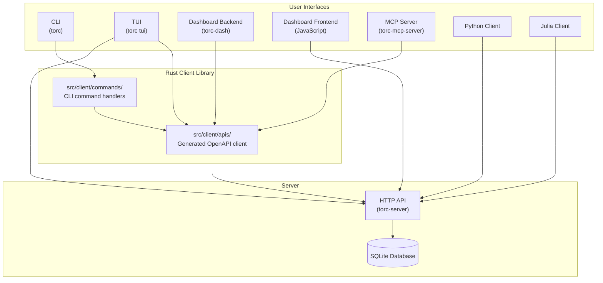

# Interface Architecture

This document describes the design decisions behind Torc's multi-interface architecture and the
patterns used to expose functionality consistently across all user-facing interfaces.

## Problem Statement

Torc needs to serve diverse user workflows:

- **Automation scripts** need programmatic access via CLI and API clients
- **Interactive monitoring** requires real-time updates via TUI and web dashboard
- **AI assistants** need structured tool access via the MCP protocol
- **External integrations** require language-agnostic HTTP APIs

Each interface has different requirements for output format, error handling, and interaction
patterns, yet all must provide consistent access to core functionality.

## Design Goals

1. **Consistency**: All interfaces expose the same core operations with consistent semantics
2. **Single Source of Truth**: Business logic lives in the server; clients are thin wrappers
3. **Interface-Appropriate UX**: Each interface adapts presentation to its context
4. **Maintainability**: Adding features should require minimal interface-specific code
5. **Discoverability**: Users should easily find available operations in each interface

## Solution Overview

The architecture follows a layered approach where the CLI serves as the foundation for Rust-based
interfaces, while external clients communicate directly with the HTTP API.



**Key architectural decisions:**

- **CLI as foundation**: The CLI (`src/client/commands/`) provides the command implementations that
  other Rust interfaces can reuse.
- **Shared Rust client library**: The TUI, Dashboard backend, and MCP server all use the generated
  Rust API client (`src/client/apis/`) as the CLI does. This client library makes HTTP requests to
  the torc-server.
- **Direct HTTP access**: The TUI, Dashboard JavaScript frontend, Python client, and Julia client
  also communicate directly with the HTTP API for certain operations.

## Interface Implementations

### CLI (Command Line Interface)

**Location**: `src/client/commands/`

**Design Pattern**: Subcommand dispatch with format-aware output

The CLI uses `clap` for argument parsing with a hierarchical command structure:

```
torc
├── workflows
│   ├── create
│   ├── list
│   ├── run
│   └── ...
├── jobs
│   ├── list
│   ├── get
│   └── ...
└── ...
```

**Key Design Decisions**:

1. **Dual Output Formats**: Every list/get command supports `--format table` (human-readable) and
   `--format json` (machine-parseable). This enables both interactive use and scripting.

2. **Pagination Built-In**: All list commands include `--offset` and `--limit` flags, mirroring the
   API's pagination model directly.

3. **Environment Variable Fallbacks**: Common parameters like `--url` fall back to environment
   variables (`TORC_API_URL`), reducing repetition in scripts.

4. **Consistent Error Output**: Errors write to stderr with context, while successful output goes to
   stdout, enabling clean piping.

**Implementation Pattern**:

```rust
pub fn handle_list(config: &Configuration, format: &str) {
    match list_items(config) {
        Ok(items) => match format {
            "json" => println!("{}", serde_json::to_string_pretty(&items).unwrap()),
            _ => display_table(&items),
        },
        Err(e) => eprintln!("Error: {}", e),
    }
}
```

### TUI (Terminal User Interface)

**Location**: `src/tui/`

**Design Pattern**: Component-based reactive UI with polling updates

**Key Design Decisions**:

1. **Separation of Concerns**:
   - `app.rs`: Application state and business logic
   - `ui.rs`: Rendering logic using ratatui
   - `api.rs`: API client with `anyhow::Result` error handling
   - `components.rs`: Reusable UI widgets (dialogs, lists)

2. **Blocking API Client**: Unlike the async server, the TUI uses `reqwest::blocking` to simplify
   the event loop. API calls happen on the main thread between render cycles.

3. **Modal Dialogs**: Confirmation dialogs for destructive actions (delete, cancel) prevent
   accidental data loss in the fast-paced terminal environment.

4. **Vim-Style Navigation**: Keyboard shortcuts follow vim conventions (j/k for navigation, Enter
   for selection) for power users.

**State Management**:

```rust
pub struct App {
    pub workflows: Vec<WorkflowModel>,
    pub selected_workflow: Option<usize>,
    pub detail_view: DetailViewType,
    pub confirmation_dialog: Option<ConfirmationDialog>,
}

impl App {
    pub fn handle_key_event(&mut self, key: KeyEvent) -> AppAction {
        if self.confirmation_dialog.is_some() {
            return self.handle_dialog_key(key);
        }
        // Normal key handling
    }
}
```

### Dashboard (Web UI)

**Location**: `torc-dash/src/`

**Design Pattern**: Axum web server using the Rust client library

**Key Design Decisions**:

1. **Shared Client Library**: The dashboard uses the same Rust API client (`src/client/apis/`) as
   the CLI, TUI, and MCP server, ensuring consistent behavior across all Rust-based interfaces.

2. **Embedded Assets**: Static files (HTML, CSS, JS) are embedded at compile time using
   `rust-embed`, producing a single binary for deployment.

3. **Server-Sent Events**: Real-time updates use SSE for workflow status changes, avoiding the
   complexity of WebSocket state management.

4. **Separate Binary**: The dashboard runs as `torc-dash`, not part of the main `torc` binary,
   allowing independent deployment and scaling.

**API Integration Pattern**:

```rust
async fn list_workflows(
    State(state): State<AppState>,
) -> Result<Json<Vec<WorkflowModel>>, StatusCode> {
    let workflows = default_api::list_workflows(&state.config, None, None, None, None)
        .map_err(|_| StatusCode::INTERNAL_SERVER_ERROR)?;

    Ok(Json(workflows.items))
}
```

### MCP Server (AI Assistant Interface)

**Location**: `torc-mcp-server/src/`

**Design Pattern**: Tool-based RPC with structured outputs

**Key Design Decisions**:

1. **Blocking Client, Async Transport**: The MCP server creates a blocking `reqwest` client before
   spawning the tokio runtime. This avoids nested runtime issues when the MCP transport is async but
   the Torc client expects blocking calls.

2. **Structured JSON Responses**: Tool outputs are JSON objects with consistent fields, making them
   easy for AI models to parse and reason about.

3. **Error as Content**: Errors are returned as structured content (not transport failures), giving
   AI assistants context to retry or explain failures.

4. **Operation Scoping**: Tools are scoped to common high-level operations (list workflows, get
   status, run workflow) rather than exposing every API endpoint.

**Tool Implementation**:

```rust
pub fn list_workflows(config: &Configuration) -> Result<CallToolResult, McpError> {
    let workflows = default_api::list_workflows(config, None, None, None, None)
        .map_err(|e| McpError::internal_error(
            format!("Failed to list workflows: {}", e), None
        ))?;

    let summary: Vec<_> = workflows.items.iter().map(|w| json!({
        "id": w.id,
        "name": w.name,
        "status": format!("{:?}", w.status),
    })).collect();

    Ok(CallToolResult::success(vec![
        Content::text(serde_json::to_string_pretty(&summary).unwrap())
    ]))
}
```

### Python/Julia API Clients

**Location**: Generated in `python_client/` and `julia_client/`

**Design Pattern**: OpenAPI-generated clients with language-idiomatic wrappers

**Key Design Decisions**:

1. **Generated Code**: Core API clients are generated from `api/openapi.yaml` using
   openapi-generator. This ensures type safety and automatic updates when the API changes.

2. **No Manual Edits**: Generated files in `openapi_client/` directories should never be manually
   edited. Customizations go in wrapper modules.

3. **Synchronous and Async**: Python client supports both sync and async usage patterns via the
   generated client's configuration.

**Regeneration Workflow**:

```bash
cd api
bash make_api_clients.sh  # Regenerates both Python and Julia clients
```

## Alternatives Considered

### GraphQL Instead of REST

**Rejected because**:

- REST's simplicity matches Torc's CRUD-heavy operations
- OpenAPI provides excellent code generation for multiple languages
- Pagination and filtering are well-handled by query parameters
- GraphQL's flexibility isn't needed for the fixed data model

### Single Unified Binary

**Rejected because**:

- The dashboard has significant web dependencies (static assets, tower middleware)
- Separate binaries allow independent deployment
- Feature flags still provide unified builds when desired

### gRPC for Internal Communication

**Rejected because**:

- HTTP/JSON is more debuggable and accessible
- Browser-based dashboard would need a proxy anyway
- Python/Julia clients benefit from REST's simplicity

## Implementation Guidelines

When adding a new feature that should be exposed to users:

1. **Start with the API**: Define the endpoint in `api/openapi.yaml` with proper schemas
2. **Implement server-side**: Add handler in `src/server/api/`
3. **Regenerate clients**: Run `api/make_api_clients.sh`
4. **Add CLI command**: Create handler in `src/client/commands/`
5. **Update TUI if applicable**: Add to relevant view in `src/tui/`
6. **Update Dashboard if applicable**: Add route in `torc-dash/src/`
7. **Add MCP tool if user-facing**: Add tool function in `torc-mcp-server/src/`
8. **Document in all interfaces**: Update reference docs for each affected interface

## Summary

Torc's multi-interface architecture achieves consistency through:

- **Centralized business logic** in the server
- **Generated API clients** from a single OpenAPI spec
- **Interface-specific adapters** that translate between user expectations and API semantics
- **Consistent data models** shared across all implementations
