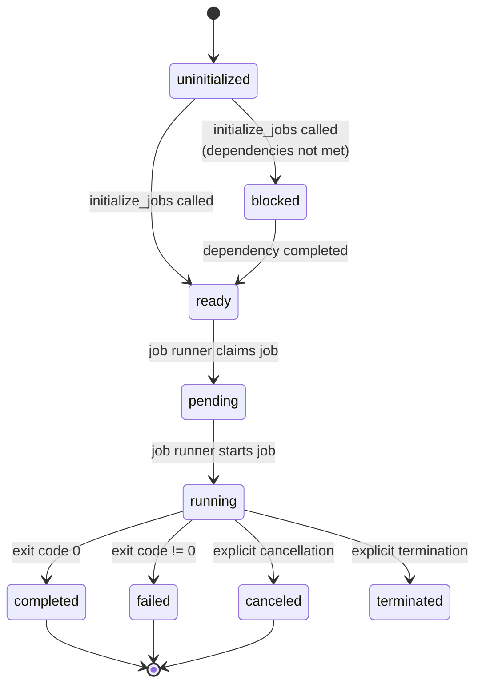

# Job State Transitions

Jobs progress through a defined lifecycle:

## State Descriptions

- **uninitialized** - Job created but dependencies not evaluated
- **ready** - All dependencies satisfied, ready for execution
- **blocked** - Waiting for dependencies to complete
- **pending** - Job claimed by runner
- **running** - Currently executing
- **done** - Finished (success or failure)
- **canceled** - Explicitly canceled by user or system
- **terminated** - Explicitly termintated by user or system
- **disabled** - Explicitly disabled by user

## Critical State Transitions

1. **initialize_jobs** - Evaluates all dependencies and sets jobs to `ready` or `blocked`
2. **manage_status_change** - Updates job status and triggers cascade effects:
   - When a job completes, checks if blocked jobs become ready
   - Updates workflow status when all jobs complete
   - Handles `cancel_on_blocking_job_failure` flag
