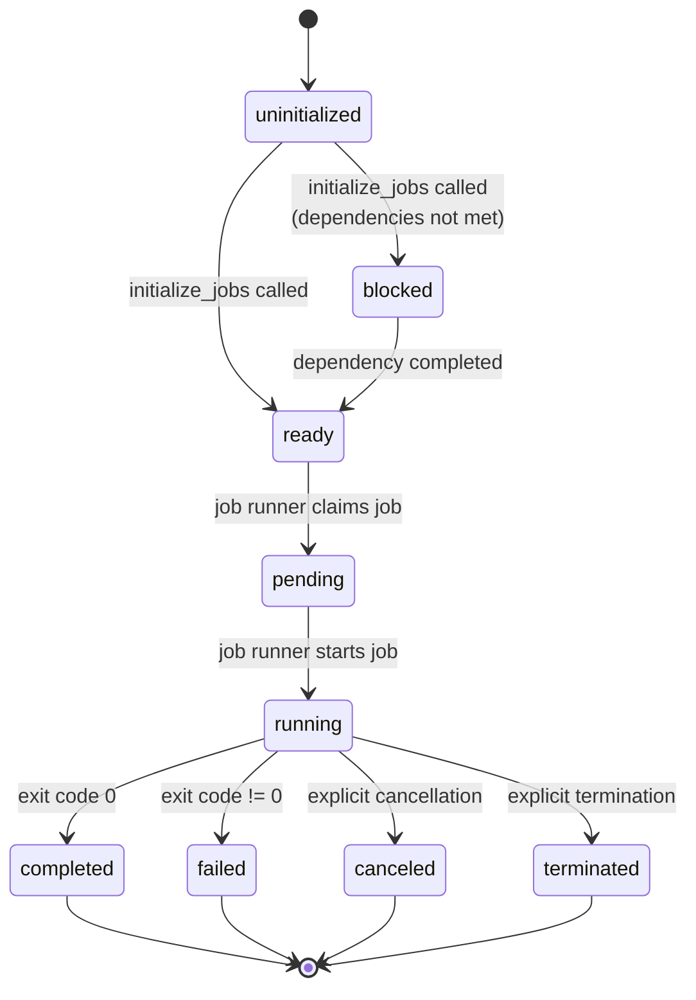

# Job State Transitions

Jobs progress through a defined lifecycle:

## State Descriptions

- **uninitialized** (0) - Job created but dependencies not evaluated
- **blocked** (1) - Waiting for dependencies to complete
- **ready** (2) - All dependencies satisfied, ready for execution
- **pending** (3) - Job claimed by runner
- **running** (4) - Currently executing
- **completed** (5) - Finished successfully (exit code 0)
- **failed** (6) - Finished with error (exit code != 0)
- **canceled** (7) - Explicitly canceled by user or system
- **terminated** (8) - Explicitly terminated by system, such as for checkpointing before wall-time
  timeout
- **disabled** (9) - Explicitly disabled by user
