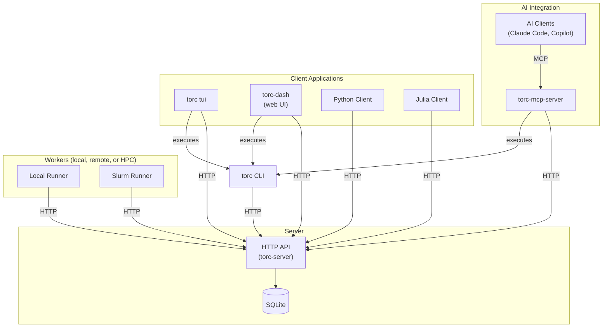

# Getting Started

**Torc** is a distributed workflow orchestration system for managing complex computational pipelines
with job dependencies, resource requirements, and distributed execution.

Torc uses a client-server architecture where a central server manages workflow state and
coordination, while clients create workflows and job runners execute tasks on compute resources.

## How You Interact with Torc

Choose the interface that fits your workflow:

- **CLI** — Primary interface which provides access to all torc functionality
- **Dashboard** — Web UI ([torc-dash](./how-to/dashboard.md)) for visual configuration and
  monitoring
- **TUI** — Terminal User Interface (`torc tui`) for visual monitoring in a terminal
- **AI Assistants** — Use [Claude Code](https://claude.ai/code) or GitHub Copilot to manage
  workflows through natural language. _"Create a workflow with 10 parallel jobs"_ or _"Why did job 5
  fail?"_
- **Spec Files** — YAML, KDL, or JSON5 files for version-controlled workflow definitions
- **Python/Julia APIs** — Libraries for programmatic workflow generation

All interfaces work with the same server — mix and match as needed.

## Architecture

**Key components:**

- **Server** — HTTP API service managing workflow state via SQLite
- **Job Runners** — Worker processes that execute jobs on compute resources
- **Clients** — CLI, dashboard, AI assistants, or API libraries

## Features

- **Declarative Workflow Specifications** — Define workflows in YAML, JSON5, JSON, or KDL
- **Job Parameterization** — Create parameter sweeps and grid searches with simple syntax
- **Automatic Dependency Resolution** — Dependencies inferred from file and data relationships
- **Distributed Execution** — Run jobs across multiple compute nodes with resource tracking
- **Slurm Integration** — Native support for HPC cluster job submission
- **Automatic Failure Recovery** — Detect OOM/timeout failures and retry with adjusted resources
- **Workflow Resumption** — Restart workflows after failures without losing progress
- **Change Detection** — Automatically detect input changes and re-run affected jobs
- **Resource Management** — Track CPU and memory across all jobs
- **RESTful API** — Complete OpenAPI-specified REST API for integration
- **AI-Assisted Management** — Create, debug, and manage workflows through conversation

## Next: Quick Start

Continue to the [Quick Start](./quick-start.md) guide to run your first workflow.
