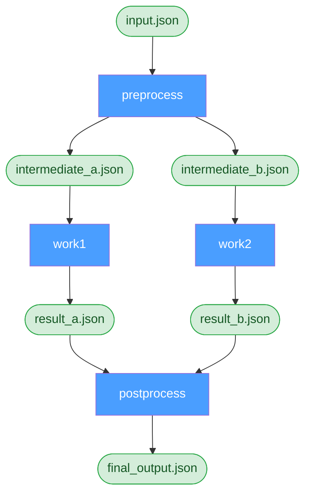

# Introduction

**Torc** is a distributed workflow orchestration system for managing computational pipelines ranging
from simple workflows needing to parallelize independent jobs to complex workflows with job
dependencies, mixed resource requirements, and multiple stages.

## Key Features

- **Declarative Workflow Definitions** — Define workflows in YAML, JSON, JSON5, or KDL
- **Automatic Dependency Resolution** — Dependencies inferred from file and data relationships
- **Distributed Execution** — Run jobs across local machines, HPC clusters, and networked compute
  nodes
- **Resource Management** — Track CPU and memory usage across all jobs
- **Automatic Failure Recovery** — Detect OOM/timeout failures and retry with adjusted resources
- **Fault Tolerance** — Resume workflows after failures without losing progress
- **AI-assisted configuration and management** — Use AI tools like Claude Code and Copilot to
  configure workflows and diagnose problems.

### Job Parameterization

Create parameter sweeps with simple syntax:

```yaml
jobs:
  - name: job_{index}
    command: bash work.sh {index}
    parameters:
      index: "1:100"
```

This expands to 100 jobs.

### Implicit Dependencies

Dependencies between jobs are automatically inferred from file relationships. Consider this diamond
workflow where one job fans out to parallel jobs, which then converge:

```yaml
name: diamond_workflow
jobs:
  - name: preprocess
    command: "preprocess.sh -i ${files.input.f1} -o ${files.output.f2} -o ${files.output.f3}"

  - name: work1
    command: "work.sh -i ${files.input.f2} -o ${files.output.f4}"

  - name: work2
    command: "work.sh -i ${files.input.f3} -o ${files.output.f5}"

  - name: postprocess
    command: "postprocess.sh -i ${files.input.f4} -i ${files.input.f5} -o ${files.output.f6}"

files:
  - name: f1
    path: input.json
  - name: f2
    path: intermediate_a.json
  - name: f3
    path: intermediate_b.json
  - name: f4
    path: result_a.json
  - name: f5
    path: result_b.json
  - name: f6
    path: final_output.json
```

Torc analyzes which jobs produce and consume each file, automatically building the dependency graph:



No explicit `depends_on` declarations needed — Torc infers that `work1` and `work2` depend on
`preprocess`, and `postprocess` waits for both to complete.

## Who Should Use Torc?

Torc is designed for:

- **HPC Users** who need to parallelize jobs across cluster resources
- **Computational Scientists** running parameter sweeps and simulations
- **Data Engineers** building complex data processing pipelines
- **ML/AI Researchers** managing training workflows and hyperparameter searches
- **Anyone** who needs reliable, resumable workflow orchestration

## Documentation Structure

This documentation is organized into:

- **[Tutorials](./tutorials/README.md)** — Step-by-step lessons to learn Torc
- **[How-To Guides](./how-to/README.md)** — Practical guides for specific tasks
- **[Explanation](./explanation/README.md)** — In-depth discussion of concepts
- **[Reference](./reference/README.md)** — Technical specifications and API docs

## Next Steps

- **New to Torc?** Start with [Getting Started](./getting-started.md)
- **Want to understand how it works?** Read the
  [Architecture Overview](./explanation/architecture.md)
- **Ready to create workflows?** Jump to [Creating Workflows](./how-to/creating-workflows.md)
- **Need specific examples?** Check out the [Tutorials](./tutorials/README.md)
