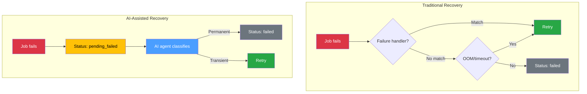
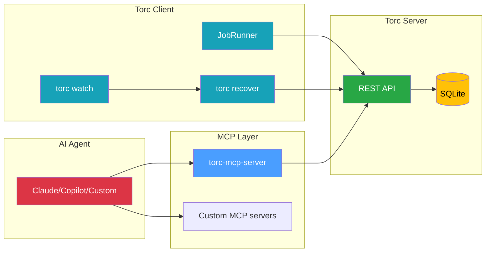
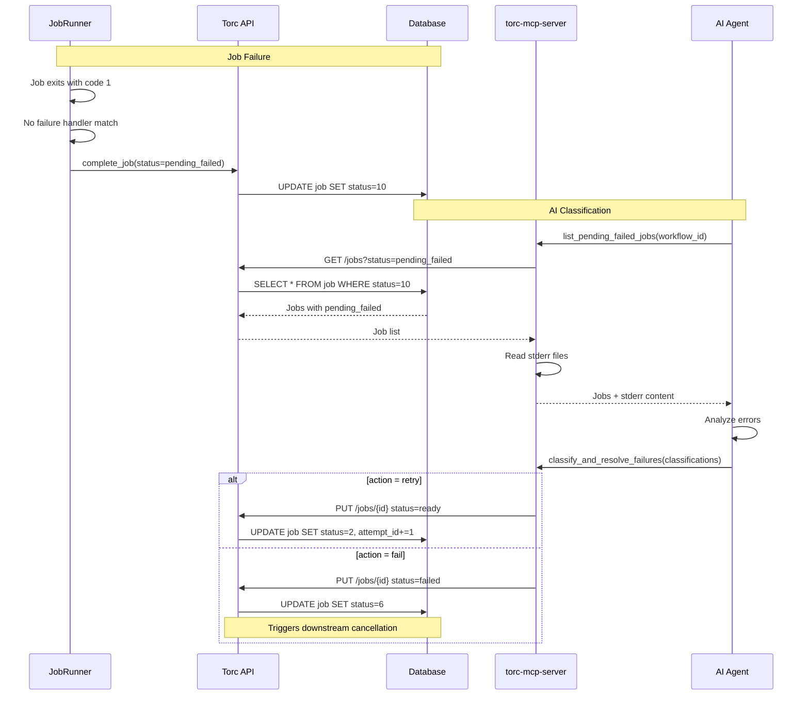
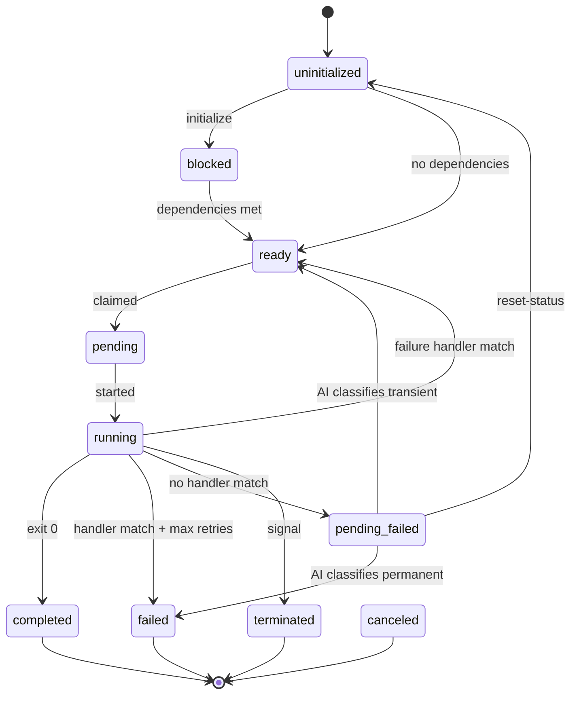

# AI-Assisted Recovery Design

> 🧪 **EXPERIMENTAL**: This feature is new and not yet well-tested. The API and behavior may change
> based on user feedback.

This document describes the architecture and implementation of AI-assisted failure recovery in Torc.
For a user-focused tutorial, see
[AI-Assisted Failure Recovery](../fault-tolerance/ai-assisted-recovery.md).

## Overview

AI-assisted recovery enables intelligent classification of job failures that can't be handled by
rule-based mechanisms (failure handlers, OOM/timeout detection). It introduces a new job status
(`pending_failed`) that defers the fail/retry decision to an AI agent.



## Problem Statement

Current recovery mechanisms have blind spots:

1. **Failure handlers**: Require predefined exit codes. Many failures use generic exit code 1.
2. **OOM/timeout detection**: Only handles resource exhaustion patterns.
3. **`--retry-unknown`**: Blindly retries all failures, wasting compute on unfixable bugs.

Real-world failures often require **contextual analysis**:

| Error                                        | Analysis Required                   | Decision            |
| -------------------------------------------- | ----------------------------------- | ------------------- |
| `Connection refused to storage.internal:443` | Was the storage server down?        | Retry if transient  |
| `NCCL timeout after 1800 seconds`            | Is this a node failure or code bug? | Retry if node issue |
| `SyntaxError: invalid syntax`                | Is the code broken?                 | Fail - needs fix    |
| `FileNotFoundError: input.csv`               | Missing input or wrong path?        | Depends on context  |

AI agents can analyze stderr, correlate with external systems, and make informed decisions.

## Architecture

### Component Overview



### Data Flow



## Job Status: pending_failed

### Status Values

| Value  | Name               | Description                    |
| ------ | ------------------ | ------------------------------ |
| 0      | uninitialized      | Not yet initialized            |
| 1      | blocked            | Waiting on dependencies        |
| 2      | ready              | Ready to run                   |
| 3      | pending            | Claimed by worker              |
| 4      | running            | Currently executing            |
| 5      | completed          | Finished successfully          |
| 6      | failed             | Failed (terminal)              |
| 7      | canceled           | Canceled by user               |
| 8      | terminated         | Killed by signal               |
| 9      | disabled           | Skipped                        |
| **10** | **pending_failed** | **Awaiting AI classification** |

### Status Transitions



### Workflow Completion Semantics

A workflow with `pending_failed` jobs is **not complete**:

```rust
fn is_workflow_complete(workflow_id: i64) -> bool {
    // Jobs in these statuses are "complete"
    let complete_statuses = [
        JobStatus::Completed,
        JobStatus::Failed,
        JobStatus::Canceled,
        JobStatus::Terminated,
        JobStatus::Disabled,
    ];

    // pending_failed is NOT in this list
    // So workflows with pending_failed jobs are incomplete

    !jobs.iter().any(|j| !complete_statuses.contains(&j.status))
}
```

This ensures:

- `torc watch` continues monitoring
- Downstream jobs remain blocked (not canceled)
- The workflow doesn't appear "done" prematurely

## Recovery Outcome Enum

The `try_recover_job` function returns detailed outcomes:

```rust
pub enum RecoveryOutcome {
    /// Job was successfully scheduled for retry
    Retried,
    /// No failure handler defined - use PendingFailed status
    NoHandler,
    /// Failure handler exists but no rule matched - use PendingFailed status
    NoMatchingRule,
    /// Max retries exceeded - use Failed status
    MaxRetriesExceeded,
    /// API call or other error - use Failed status
    Error(String),
}
```

Usage in `handle_job_completion`:

```rust
match self.try_recover_job(job_id, ...) {
    RecoveryOutcome::Retried => {
        // Job queued for retry, clean up
        return;
    }
    RecoveryOutcome::NoHandler | RecoveryOutcome::NoMatchingRule => {
        // Check if workflow has use_pending_failed enabled
        if self.workflow.use_pending_failed.unwrap_or(false) {
            // Use pending_failed for AI classification
            final_result.status = JobStatus::PendingFailed;
        } else {
            // Use failed status (default behavior)
            // (status already Failed)
        }
    }
    RecoveryOutcome::MaxRetriesExceeded | RecoveryOutcome::Error(_) => {
        // Use failed - no recovery possible
        // (status already Failed)
    }
}
```

## Enabling AI-Assisted Recovery

**AI-assisted recovery is opt-in per workflow** using the `use_pending_failed` flag. By default,
jobs that fail without a matching failure handler get the `Failed` status.

### Workflow Specification

Add `use_pending_failed: true` to your workflow spec to enable:

```yaml
name: ml_training
use_pending_failed: true  # Enable AI-assisted recovery

jobs:
  - name: train_model
    command: python train.py
```

Without this flag (or with `use_pending_failed: false`), jobs use the traditional behavior:

- Failure handler match → retry
- No failure handler → `Failed` status
- Max retries exceeded → `Failed` status

With `use_pending_failed: true`:

- Failure handler match → retry
- No failure handler → `PendingFailed` status (awaiting AI classification)
- Max retries exceeded → `Failed` status

### Why Opt-In?

The default behavior prioritizes predictability and backward compatibility:

1. **Existing workflows continue to work** - no breaking changes
2. **Clear failure semantics** - jobs either retry or fail immediately
3. **No external dependencies** - doesn't require AI agent integration

Opt-in when you want:

- Intelligent classification of ambiguous failures
- Human/AI review before retry decisions
- Reduced compute waste from blind retries

## MCP Server Tools

### list_pending_failed_jobs

Lists jobs awaiting classification with their stderr content.

**Implementation:**

```rust
pub fn list_pending_failed_jobs(
    config: &Configuration,
    workflow_id: i64,
    output_dir: &Path,
) -> Result<CallToolResult, McpError> {
    // 1. Query jobs with pending_failed status
    let jobs = paginate_jobs(config, workflow_id,
        JobListParams::new().with_status(JobStatus::PendingFailed));

    // 2. For each job, fetch result and read stderr tail
    for job in &jobs {
        let result = get_latest_result(job.id);
        let stderr_path = get_job_stderr_path(output_dir, ...);
        let stderr_tail = read_last_n_lines(&stderr_path, 50);

        // Include in response
    }

    // 3. Return structured response with guidance
}
```

### classify_and_resolve_failures

Applies AI classifications to jobs.

**Classification struct:**

```rust
pub struct FailureClassification {
    pub job_id: i64,
    pub action: String,         // "retry" or "fail"
    pub memory: Option<String>, // Optional resource adjustment
    pub runtime: Option<String>,
    pub reason: Option<String>, // For audit trail
}
```

**Implementation:**

```rust
pub fn classify_and_resolve_failures(
    config: &Configuration,
    workflow_id: i64,
    classifications: Vec<FailureClassification>,
    dry_run: bool,
) -> Result<CallToolResult, McpError> {
    for classification in &classifications {
        // 1. Validate job is in pending_failed status
        // 2. Apply resource adjustments if specified
        // 3. Set status based on action:
        //    - "retry": status = ready, attempt_id += 1
        //    - "fail": status = failed (triggers cascade)
    }
}
```

## Integration with reset-status

The `reset-status --failed-only` command also resets `pending_failed` jobs:

```sql
-- reset_failed_jobs_only query
SELECT id, status FROM job
WHERE workflow_id = $1
  AND status IN (
    $failed_status,
    $canceled_status,
    $terminated_status,
    $pending_failed_status  -- Added
  )
```

This allows users to reset pending_failed jobs without AI classification if desired.

## Error Classification Patterns

The AI agent should recognize common patterns:

### Transient Errors

```rust
const TRANSIENT_PATTERNS: &[&str] = &[
    // Network
    "Connection refused",
    "Connection timed out",
    "Network is unreachable",
    "DNS resolution failed",
    "Service Unavailable",

    // GPU/HPC
    "NCCL timeout",
    "GPU communication error",
    "CUDA out of memory",  // Could be transient if memory is shared

    // Hardware
    "EIO",
    "Input/output error",

    // Slurm
    "PREEMPTED",
    "NODE_FAIL",
    "TIMEOUT",  // Slurm walltime, not job timeout
];
```

### Permanent Errors

```rust
const PERMANENT_PATTERNS: &[&str] = &[
    // Python
    "SyntaxError",
    "IndentationError",
    "ModuleNotFoundError",
    "ImportError",
    "NameError",
    "TypeError",
    "ValueError",

    // General
    "FileNotFoundError",  // For input files
    "PermissionDenied",
    "AssertionError",
    "IndexError",
    "KeyError",
];
```

These patterns are **guidance for AI agents**, not hard-coded rules. The AI can use context to
override (e.g., `FileNotFoundError` for a file that should be created by an upstream job might be
transient if the upstream job is being retried).

## Slurm Integration

When `pending_failed` jobs are classified as "retry", they return to `ready` status. For Slurm
workflows:

1. If active allocations exist, jobs may run immediately
2. If no allocations, `torc watch --auto-schedule` will create new ones
3. Manual recovery: `torc slurm regenerate --submit`

## Design Decisions

### Why a New Status vs. a Flag?

**Alternative considered**: Add `needs_classification: bool` flag to jobs.

**Decision**: New status is cleaner because:

- Status is already used for state machine transitions
- `is_workflow_complete` naturally excludes `pending_failed`
- No schema changes to existing status column
- Clearer semantics in logs and UI

### Why Defer to AI vs. Built-in Heuristics?

**Alternative considered**: Build pattern matching into Torc directly.

**Decision**: AI-assisted approach because:

- Error patterns are domain-specific and evolving
- AI can use context (multiple errors, timing, external systems)
- Users can customize via custom MCP servers
- Avoids bloating Torc with error classification logic

### Why Not Block on AI Response?

**Alternative considered**: Job runner waits for AI classification.

**Decision**: Asynchronous classification because:

- AI inference adds latency (seconds to minutes)
- AI service may be unavailable
- Human oversight is valuable for production workflows
- Jobs can accumulate for batch classification

## CLI Integration

The `torc recover` and `torc watch` commands support automatic AI agent invocation:

### Command-Line Options

| Option          | Default  | Description                                      |
| --------------- | -------- | ------------------------------------------------ |
| `--ai-recovery` | false    | Enable AI-assisted classification                |
| `--ai-agent`    | `claude` | AI agent CLI to invoke (currently only `claude`) |

### Invocation Flow

When `--ai-recovery` is enabled:

```rust
pub fn invoke_ai_agent(workflow_id: i64, agent: &str, output_dir: &Path) -> Result<(), String> {
    // 1. Check if agent CLI is available (e.g., `which claude`)
    // 2. Build prompt with workflow context
    // 3. Spawn agent with --print flag for non-interactive mode
    // 4. Capture and log output
    // 5. Return success/failure
}
```

The prompt instructs the AI agent to:

1. Call `list_pending_failed_jobs` to get jobs with stderr
2. Analyze each job's error to classify as transient or permanent
3. Call `classify_and_resolve_failures` with classifications

### Agent Requirements

For the `claude` agent:

- Claude Code CLI must be installed (`claude` command in PATH)
- Torc MCP server must be configured in `~/.claude/mcp_servers.json`
- The `--print` flag is used for non-interactive execution

## Implementation Files

| File                             | Purpose                                          |
| -------------------------------- | ------------------------------------------------ |
| `src/models.rs`                  | `JobStatus::PendingFailed` enum variant          |
| `src/client/job_runner.rs`       | `RecoveryOutcome` enum, status assignment        |
| `src/client/commands/recover.rs` | `invoke_ai_agent` function, CLI integration      |
| `src/server/api/jobs.rs`         | `reset_failed_jobs_only` includes pending_failed |
| `torc-mcp-server/src/tools.rs`   | MCP tool implementations                         |
| `torc-mcp-server/src/server.rs`  | MCP server handlers                              |

## Future Enhancements

1. **Confidence thresholds**: AI classifies with confidence score; low confidence escalates to user
2. **Learning from outcomes**: Track whether AI classifications led to successful retries
3. **Batch scheduling optimization**: AI recommends optimal Slurm allocations for retry jobs
4. **Custom MCP server examples**: Templates for domain-specific error classification
