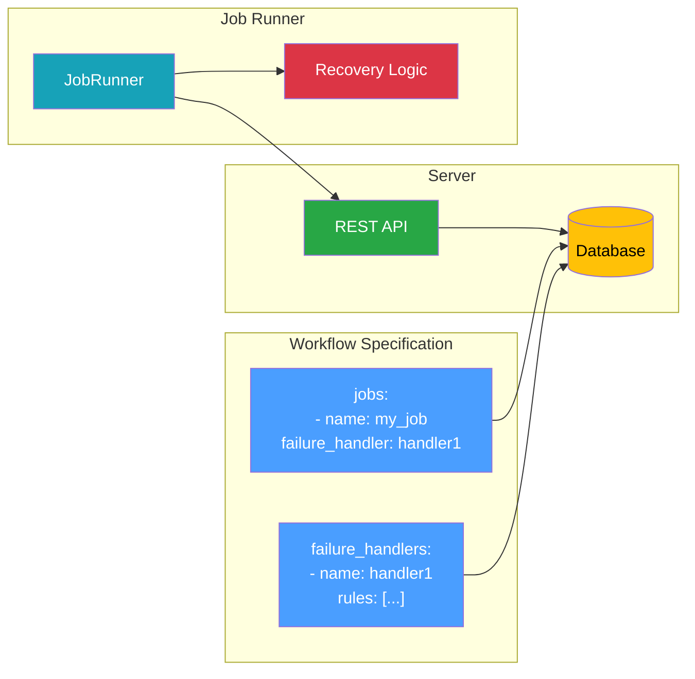
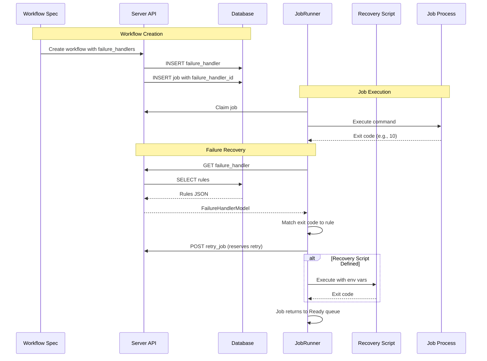
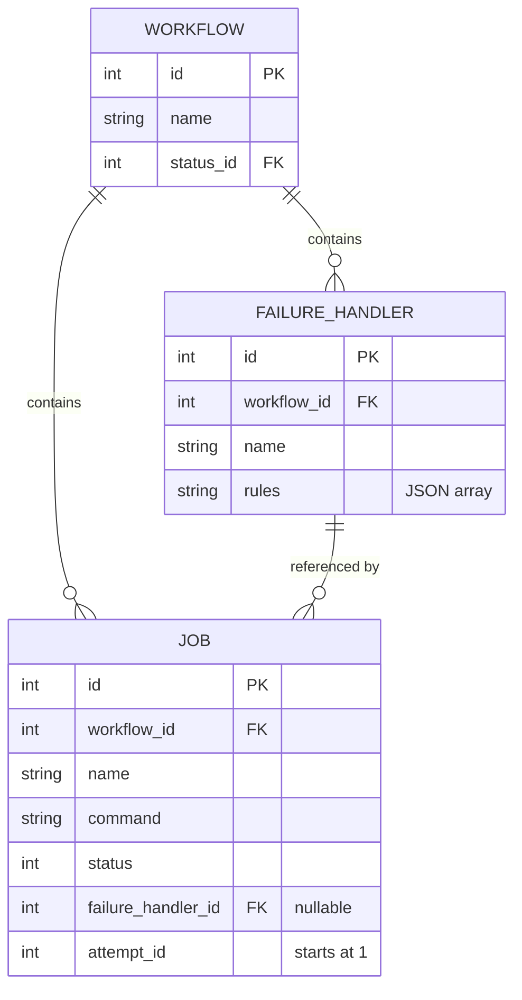
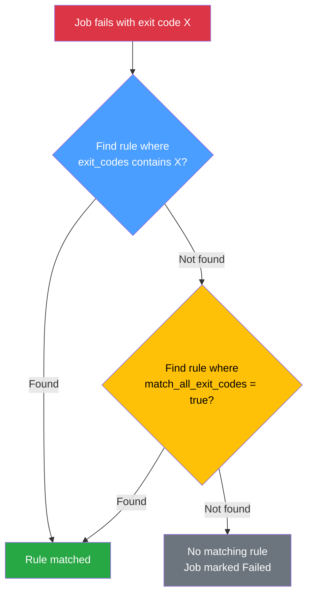
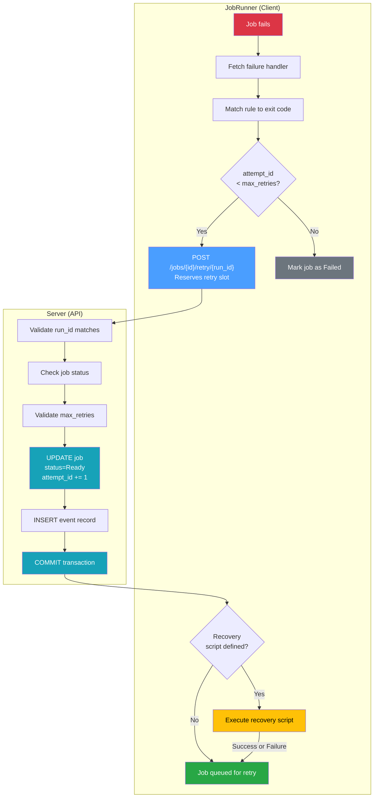
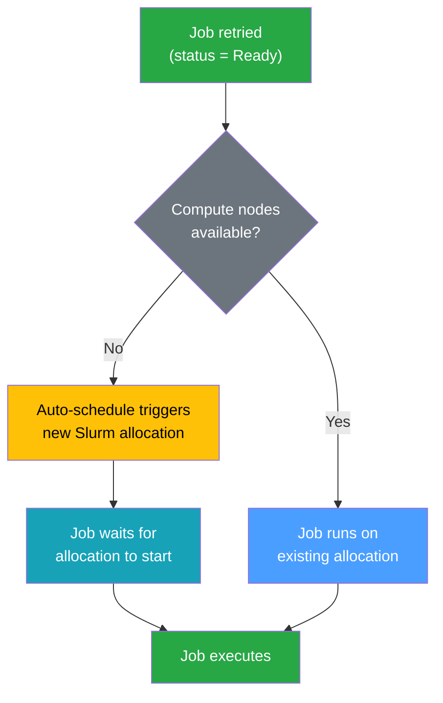
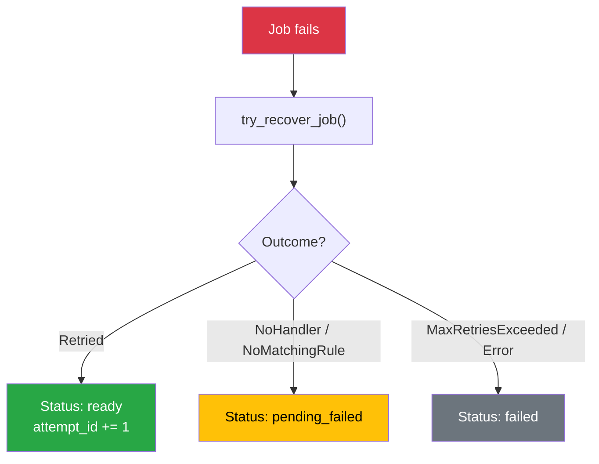
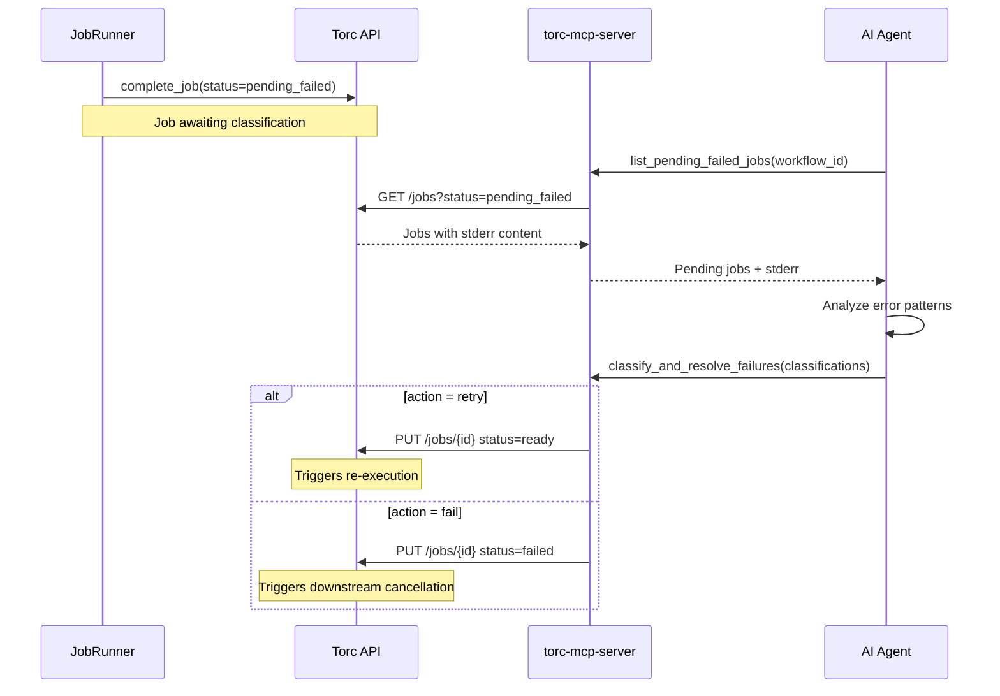

# Failure Handler Design

This document describes the internal architecture and implementation of failure handlers in Torc.
For a user-focused tutorial, see
[Configurable Failure Handlers](../fault-tolerance/failure-handlers.md).

## Overview

Failure handlers provide per-job automatic retry logic based on exit codes. They allow workflows to
recover from transient failures without manual intervention or workflow-level recovery heuristics.



## Problem Statement

When jobs fail, workflows traditionally have two recovery options:

1. **Manual intervention**: User investigates and restarts failed jobs
2. **Workflow-level recovery**: `torc watch --recover` applies heuristics based on detected failure
   patterns (OOM, timeout, etc.)

Neither approach handles **application-specific failures** where:

- The job itself knows why it failed (via exit code)
- A specific recovery action can fix the issue
- Immediate retry is appropriate

Failure handlers solve this by allowing jobs to define exit-code-specific retry behavior with
optional recovery scripts.

## Architecture

### Component Interaction



### Data Model



## Rule Matching

Failure handler rules are stored as a JSON array. When a job fails, rules are evaluated in a
specific order to find a match.

### Rule Structure

```rust
pub struct FailureHandlerRule {
    pub exit_codes: Vec<i32>,         // Specific codes to match
    pub match_all_exit_codes: bool,   // Catch-all flag
    pub recovery_script: Option<String>,
    pub max_retries: i32,             // Default: 3
}
```

### Matching Priority

Rules are evaluated with **specific matches taking priority over catch-all rules**:



This ensures that specific exit code handlers always take precedence, regardless of rule order in
the JSON array.

**Implementation** (`job_runner.rs`):

```rust
let matching_rule = rules
    .iter()
    .find(|rule| rule.exit_codes.contains(&(exit_code as i32)))
    .or_else(|| rules.iter().find(|rule| rule.match_all_exit_codes));
```

## Recovery Flow

The recovery process is designed to be **atomic** and **safe**:



### Key Design Decisions

1. **Retry reservation before recovery script**: The `retry_job` API is called **before** the
   recovery script runs. This ensures:

   - The retry slot is reserved atomically
   - Recovery scripts don't run for retries that won't happen
   - External resources modified by recovery scripts are consistent

2. **Recovery script failure is non-fatal**: If the recovery script fails, the job is still retried.
   This prevents recovery script bugs from blocking legitimate retries.

3. **Transaction isolation**: The `retry_job` API uses `BEGIN IMMEDIATE` to prevent race conditions
   where multiple processes might try to retry the same job.

## API Endpoints

### GET /failure_handlers/{id}

Fetches a failure handler by ID.

**Response:**

```json
{
  "id": 1,
  "workflow_id": 42,
  "name": "simulation_recovery",
  "rules": "[{\"exit_codes\":[10,11],\"max_retries\":3}]"
}
```

### POST /jobs/{id}/retry/{run_id}?max_retries=N

Retries a failed job by resetting its status to Ready.

**Query Parameters:**

- `max_retries` (required): Maximum retries allowed by the matching rule

**Validations:**

1. Job must exist
2. `run_id` must match workflow's current run
3. Job status must be Running, Failed, or Terminated
4. `attempt_id` must be less than `max_retries`

**Transaction Safety:**

```sql
BEGIN IMMEDIATE;  -- Acquire write lock

SELECT j.*, ws.run_id as workflow_run_id
FROM job j
JOIN workflow w ON j.workflow_id = w.id
JOIN workflow_status ws ON w.status_id = ws.id
WHERE j.id = ?;

-- Validate conditions...

UPDATE job SET status = 2, attempt_id = ? WHERE id = ?;

INSERT INTO event (workflow_id, timestamp, data) VALUES (?, ?, ?);

COMMIT;
```

**Response:**

```json
{
  "id": 123,
  "workflow_id": 42,
  "name": "my_job",
  "status": "ready",
  "attempt_id": 2
}
```

## Recovery Script Execution

Recovery scripts run in a subprocess with environment variables providing context:

```mermaid
flowchart LR
    subgraph env["Environment Variables"]
        WID["TORC_WORKFLOW_ID"]
        JID["TORC_JOB_ID"]
        JN["TORC_JOB_NAME"]
        URL["TORC_API_URL"]
        OUT["TORC_OUTPUT_DIR"]
        AID["TORC_ATTEMPT_ID"]
        RC["TORC_RETURN_CODE"]
    end

    subgraph script["Recovery Script"]
        SHELL["bash -c<br/>(or cmd /C on Windows)"]
        CODE["User script code"]
    end

    env --> SHELL
    SHELL --> CODE

    style WID fill:#4a9eff,color:#fff
    style JID fill:#4a9eff,color:#fff
    style JN fill:#4a9eff,color:#fff
    style URL fill:#4a9eff,color:#fff
    style OUT fill:#4a9eff,color:#fff
    style AID fill:#ffc107,color:#000
    style RC fill:#dc3545,color:#fff
    style SHELL fill:#6c757d,color:#fff
    style CODE fill:#28a745,color:#fff
```



## Log File Naming

Each job attempt produces separate log files to preserve history:

```
output/job_stdio/
├── job_wf{W}_j{J}_r{R}_a1.o   # Attempt 1 stdout
├── job_wf{W}_j{J}_r{R}_a1.e   # Attempt 1 stderr
├── job_wf{W}_j{J}_r{R}_a2.o   # Attempt 2 stdout
├── job_wf{W}_j{J}_r{R}_a2.e   # Attempt 2 stderr
└── ...
```

Where:

- `W` = workflow_id
- `J` = job_id
- `R` = run_id
- `aN` = attempt number

## Database Schema

### failure_handler Table

```sql
CREATE TABLE failure_handler (
    id INTEGER PRIMARY KEY AUTOINCREMENT,
    workflow_id INTEGER NOT NULL REFERENCES workflow(id) ON DELETE CASCADE,
    name TEXT NOT NULL,
    rules TEXT NOT NULL,  -- JSON array of FailureHandlerRule
    UNIQUE(workflow_id, name)
);
```

### job Table (relevant columns)

```sql
ALTER TABLE job ADD COLUMN failure_handler_id INTEGER
    REFERENCES failure_handler(id) ON DELETE SET NULL;

ALTER TABLE job ADD COLUMN attempt_id INTEGER NOT NULL DEFAULT 1;
```

## Slurm Integration

When a job is retried, it returns to the Ready queue and will be picked up by any available compute
node. For Slurm workflows, this may require additional allocations if existing nodes have
terminated.



If `auto_schedule_on_ready_jobs` actions are configured, new Slurm allocations will be created
automatically when retried jobs become ready. See [Workflow Actions](./workflow-actions.md) for
details.

## Implementation Files

| File                                 | Purpose                                |
| ------------------------------------ | -------------------------------------- |
| `src/client/job_runner.rs`           | `try_recover_job()`, rule matching     |
| `src/client/utils.rs`                | `shell_command()` cross-platform shell |
| `src/server/api/jobs.rs`             | `retry_job()` API endpoint             |
| `src/server/api/failure_handlers.rs` | CRUD operations for failure handlers   |
| `src/client/workflow_spec.rs`        | Parsing failure handlers from specs    |
| `migrations/20260110*.sql`           | Database schema for failure handlers   |

## Comparison with Workflow Recovery

| Aspect              | Failure Handlers               | Workflow Recovery (`torc watch`)  |
| ------------------- | ------------------------------ | --------------------------------- |
| **Scope**           | Per-job                        | Workflow-wide                     |
| **Trigger**         | Specific exit codes            | OOM detection, timeout patterns   |
| **Timing**          | Immediate (during job run)     | After job completion              |
| **Recovery Action** | Custom scripts                 | Resource adjustment, resubmission |
| **Configuration**   | In workflow spec               | Command-line flags                |
| **State**           | Preserved (same workflow run)  | May start new run                 |
| **Slurm**           | Reuses or auto-schedules nodes | Creates new schedulers            |

**Recommendation:** Use both mechanisms together:

- Failure handlers for immediate, exit-code-specific recovery
- `torc watch --recover` for workflow-level resource adjustments and allocation recovery

## Recovery Outcome and pending_failed Status

When `try_recover_job` is called, it returns a `RecoveryOutcome` enum that determines the final job
status:

```rust
pub enum RecoveryOutcome {
    /// Job was successfully scheduled for retry
    Retried,
    /// No failure handler defined - use PendingFailed status
    NoHandler,
    /// Failure handler exists but no rule matched - use PendingFailed status
    NoMatchingRule,
    /// Max retries exceeded - use Failed status
    MaxRetriesExceeded,
    /// API call or other error - use Failed status
    Error(String),
}
```

### Status Assignment Flow



### pending_failed Status (value 10)

The `pending_failed` status is a new job state that indicates:

1. The job failed with a non-zero exit code
2. No failure handler rule matched the exit code
3. The job is awaiting classification (retry or fail)

**Key properties:**

- **Not terminal**: Workflow is not considered complete while jobs are `pending_failed`
- **Downstream blocked**: Dependent jobs remain in `blocked` status (not canceled)
- **Resettable**: `reset-status --failed-only` includes `pending_failed` jobs

### Integration with AI-Assisted Recovery

Jobs in `pending_failed` status can be classified by an AI agent using MCP tools:



See [AI-Assisted Recovery Design](./ai-assisted-recovery.md) for full details.
