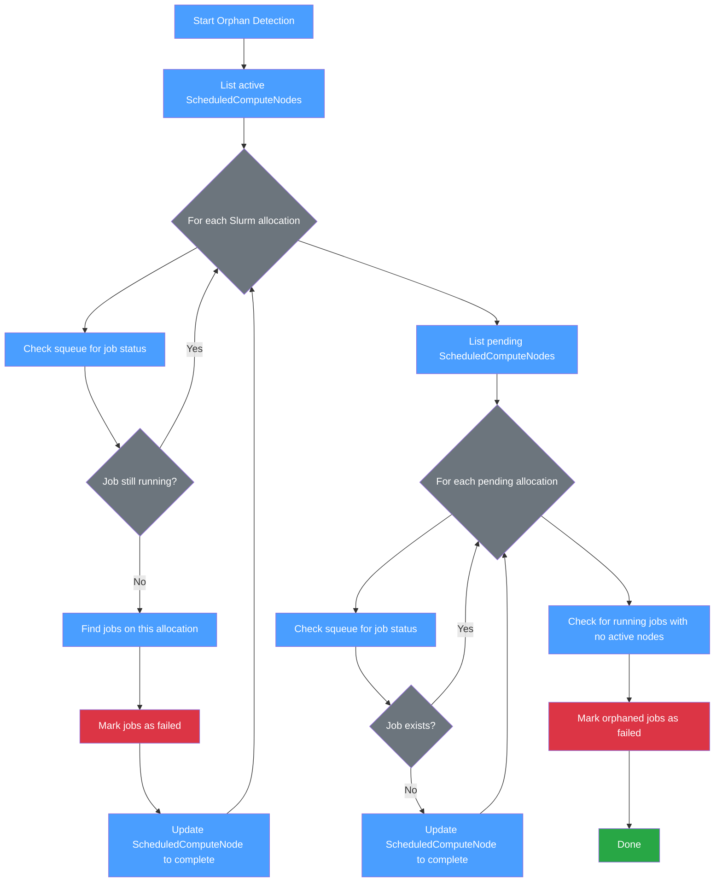
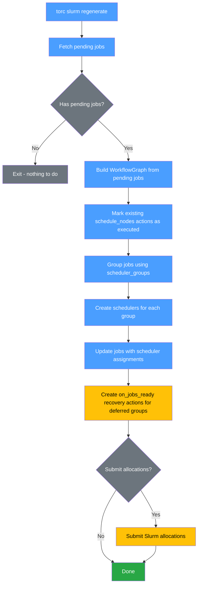
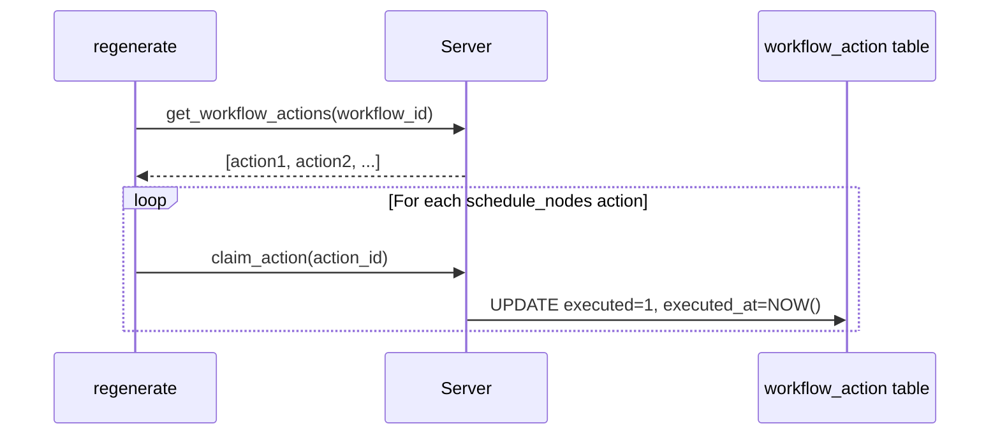
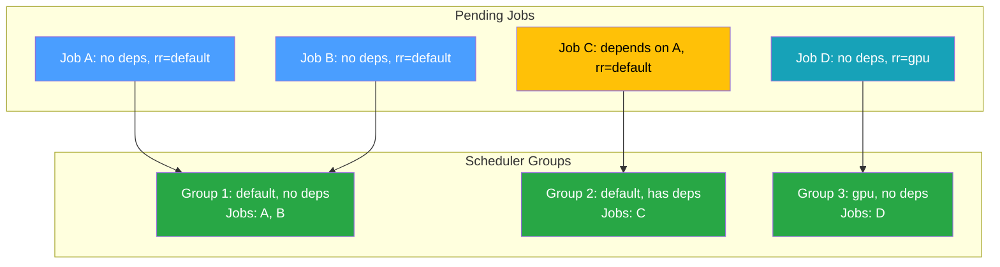
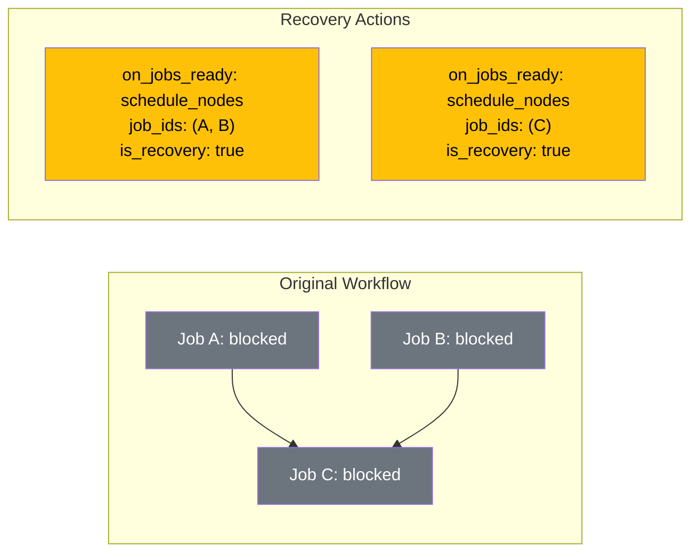
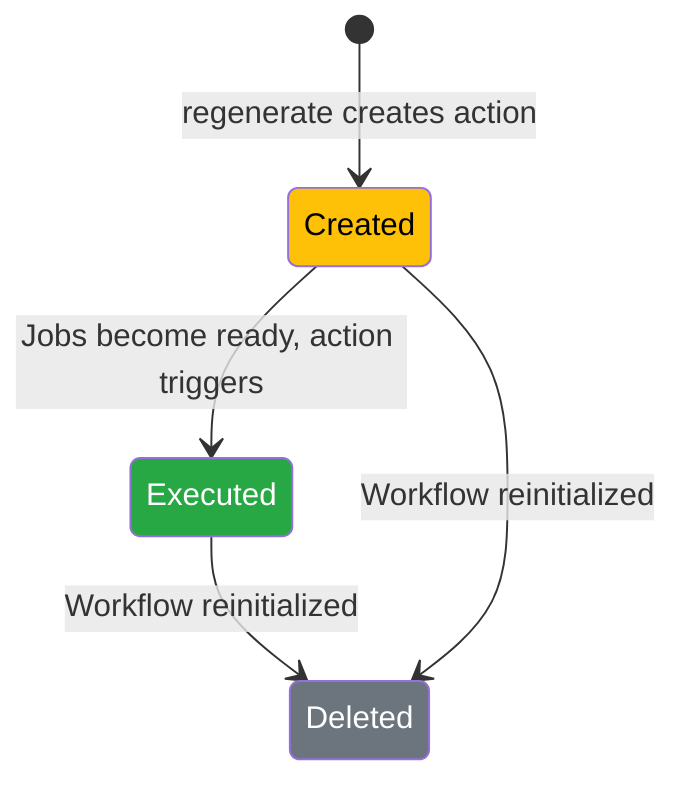

# Workflow Recovery

Torc provides mechanisms for recovering workflows when Slurm allocations are preempted or fail
before completing all jobs. The `torc slurm regenerate` command creates new schedulers and
allocations for pending jobs.

## The Recovery Problem

When running workflows on Slurm, allocations can fail or be preempted before all jobs complete. This
leaves workflows in a partial state with:

1. **Ready/uninitialized jobs** - Jobs that were waiting to run but never got scheduled
2. **Blocked jobs** - Jobs whose dependencies haven't completed yet
3. **Orphaned running jobs** - Jobs still marked as "running" in the database even though their
   Slurm allocation has terminated

Simply creating new Slurm schedulers and submitting allocations isn't enough because:

1. **Orphaned jobs block recovery**: Jobs stuck in "running" status prevent the workflow from being
   considered complete, blocking recovery precondition checks
2. **Duplicate allocations**: If the workflow had `on_workflow_start` actions to schedule nodes,
   those actions would fire again when the workflow is reinitialized, creating duplicate allocations
3. **Missing allocations for blocked jobs**: Blocked jobs will eventually become ready, but there's
   no mechanism to schedule new allocations for them

## Orphan Detection

Before recovery can proceed, orphaned jobs must be detected and their status corrected. This is
handled by the **orphan detection** module (`src/client/commands/orphan_detection.rs`).

### How It Works

The orphan detection logic checks for three types of orphaned resources:

1. **Active allocations with terminated Slurm jobs**: ScheduledComputeNodes marked as "active" in
   the database, but whose Slurm job is no longer running (verified via `squeue`)

2. **Pending allocations that disappeared**: ScheduledComputeNodes marked as "pending" whose Slurm
   job no longer exists (cancelled or failed before starting)

3. **Running jobs with no active compute nodes**: Jobs marked as "running" but with no active
   compute nodes to process them (fallback for non-Slurm cases)



### Integration Points

Orphan detection is integrated into two commands:

1. **`torc recover`**: Runs orphan detection automatically as the first step before checking
   preconditions. This ensures that orphaned jobs don't block recovery.

2. **`torc workflows sync-status`**: Standalone command to run orphan detection without triggering a
   full recovery. Useful for debugging or when you want to clean up orphaned jobs without submitting
   new allocations.

### The `torc watch` Command

The `torc watch` command also performs orphan detection during its polling loop. When it detects
that no valid Slurm allocations exist (via a quick `squeue` check), it runs the full orphan
detection logic to clean up any orphaned jobs before checking if the workflow can make progress.

## Recovery Actions

The recovery system uses **ephemeral recovery actions** to solve these problems.

### How It Works

When `torc slurm regenerate` runs:



### Step 1: Mark Existing Actions as Executed

All existing `schedule_nodes` actions are marked as executed using the `claim_action` API. This
prevents them from firing again and creating duplicate allocations:



### Step 2: Group Jobs Using WorkflowGraph

The system builds a `WorkflowGraph` from pending jobs and uses `scheduler_groups()` to group them by
`(resource_requirements, has_dependencies)`. This aligns with the behavior of
`torc workflows create-slurm`:

- **Jobs without dependencies**: Can be scheduled immediately with `on_workflow_start`
- **Jobs with dependencies** (deferred): Need `on_jobs_ready` recovery actions to schedule when they
  become ready



### Step 3: Create Recovery Actions for Deferred Groups

For groups with `has_dependencies = true`, the system creates `on_jobs_ready` recovery actions.
These actions:

- Have `is_recovery = true` to mark them as ephemeral
- Use a `_deferred` suffix in the scheduler name
- Trigger when the blocked jobs become ready
- Schedule additional Slurm allocations for those jobs



## Recovery Action Lifecycle

Recovery actions are ephemeral - they exist only during the recovery period:



When a workflow is reinitialized (e.g., after resetting jobs), all recovery actions are deleted and
original actions are reset to their initial state. This ensures a clean slate for the next run.

## Database Schema

Recovery actions are tracked using the `is_recovery` column in the `workflow_action` table:

| Column        | Type    | Description                            |
| ------------- | ------- | -------------------------------------- |
| `is_recovery` | INTEGER | 0 = normal action, 1 = recovery action |

### Behavior Differences

| Operation                           | Normal Actions        | Recovery Actions        |
| ----------------------------------- | --------------------- | ----------------------- |
| On `reset_actions_for_reinitialize` | Reset `executed` to 0 | Deleted entirely        |
| Created by                          | Workflow spec         | `torc slurm regenerate` |
| Purpose                             | Configured behavior   | Temporary recovery      |

## Usage

```bash
# Regenerate schedulers for pending jobs
torc slurm regenerate <workflow_id> --account <account>

# With automatic submission
torc slurm regenerate <workflow_id> --account <account> --submit

# Using a specific HPC profile
torc slurm regenerate <workflow_id> --account <account> --profile kestrel
```

## Implementation Details

The recovery logic is implemented in:

- `src/client/commands/orphan_detection.rs`: Shared orphan detection logic used by `recover`,
  `watch`, and `workflows sync-status`
- `src/client/commands/recover.rs`: Main recovery command implementation
- `src/client/commands/slurm.rs`: `handle_regenerate` function for Slurm scheduler regeneration
- `src/client/workflow_graph.rs`: `WorkflowGraph::from_jobs()` and `scheduler_groups()` methods
- `src/server/api/workflow_actions.rs`: `reset_actions_for_reinitialize` function
- `migrations/20251225000000_add_is_recovery_to_workflow_action.up.sql`: Schema migration

Key implementation notes:

1. **WorkflowGraph construction**: A `WorkflowGraph` is built from pending jobs using `from_jobs()`,
   which reconstructs the dependency structure from `depends_on_job_ids`
2. **Scheduler grouping**: Jobs are grouped using `scheduler_groups()` by
   `(resource_requirements, has_dependencies)`, matching `create-slurm` behavior
3. **Deferred schedulers**: Groups with dependencies get a `_deferred` suffix in the scheduler name
4. **Allocation calculation**: Number of allocations is based on job count and resources per node
5. **Recovery actions**: Only deferred groups (jobs with dependencies) get `on_jobs_ready` recovery
   actions
