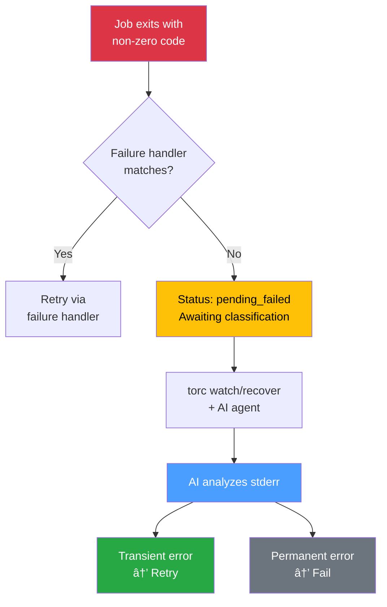

# Tutorial: AI-Assisted Failure Recovery

> 🧪 **EXPERIMENTAL**: This feature is new and not yet well-tested. The API and behavior may change
> based on user feedback.

This tutorial shows how to use AI agents (Claude Code, GitHub Copilot, or custom MCP clients) to
intelligently classify and recover from workflow failures that can't be handled by rule-based
mechanisms.

## Learning Objectives

By the end of this tutorial, you will:

- Understand the `pending_failed` job status
- Configure workflows for AI-assisted recovery
- Use the torc MCP server with AI agents
- Classify transient vs permanent errors

## Prerequisites

- Torc installed with the client feature
- A running Torc server
- An MCP-compatible AI agent (Claude Code, GitHub Copilot, or custom)
- `torc-mcp-server` installed

## The Problem

Traditional recovery mechanisms have limitations:

| Mechanism                  | Limitation                            |
| -------------------------- | ------------------------------------- |
| **Failure handlers**       | Require predefined exit codes         |
| **`torc watch --recover`** | Only handles OOM and timeout patterns |
| **`--retry-unknown`**      | Blindly retries everything            |

Some failures require **intelligent classification**:

- **Transient errors**: Network timeouts, node failures, service outages - should retry
- **Permanent errors**: Code bugs, missing files, invalid inputs - should fail

AI agents can analyze error logs and make these distinctions.

## How It Works



When a job fails without a matching failure handler rule, it enters the `pending_failed` status
instead of `failed`. This prevents immediate downstream job cancellation and gives the AI agent time
to classify the error.

## Quick Start

### Option A: Automatic AI Agent Invocation (Recommended)

Use the `--ai-recovery` flag to automatically invoke the Claude CLI for classification:

```bash
# One-shot recovery with AI classification
torc recover 123 --ai-recovery

# Continuous monitoring with AI classification
torc watch 123 --ai-recovery

# Specify a different AI agent
torc recover 123 --ai-recovery --ai-agent claude     # Default
torc recover 123 --ai-recovery --ai-agent copilot    # GitHub Copilot
```

When `--ai-recovery` is enabled:

1. Torc detects jobs in `pending_failed` status
2. Automatically invokes the AI agent CLI with the torc MCP server
3. AI agent analyzes stderr and classifies each job as transient (retry) or permanent (fail)
4. Classifications are applied via MCP tools
5. Recovery continues with the newly classified jobs

**Requirements:**

- **Claude**: Claude Code CLI installed (`claude` command available)
- **GitHub Copilot**: GitHub CLI with Copilot installed (`gh copilot` command available)
- Torc MCP server configured in your AI agent's MCP settings

### Option B: Manual AI Agent Invocation

If you prefer manual control, configure your AI agent and invoke it yourself.

#### 1. Start the MCP Server

```bash
torc-mcp-server --url http://localhost:8080/torc-service/v1
```

#### 2. Configure Your AI Agent

Add the torc MCP server to your agent's configuration:

**Claude Code (`~/.claude/mcp_servers.json`):**

```json
{
  "mcpServers": {
    "torc": {
      "command": "torc-mcp-server",
      "args": ["--url", "http://localhost:8080/torc-service/v1"]
    }
  }
}
```

**GitHub Copilot (`.github/copilot/mcp-config.json` or global config):**

```json
{
  "mcpServers": {
    "torc": {
      "command": "torc-mcp-server",
      "args": ["--url", "http://localhost:8080/torc-service/v1"]
    }
  }
}
```

#### 3. Run a Workflow

```bash
torc run my_workflow.yaml
```

#### 4. Monitor with AI Recovery

When jobs fail, use your AI agent to:

1. List pending failures:
   ```
   Agent: Use list_pending_failed_jobs with workflow_id=123
   ```

2. Analyze the errors:
   ```
   Agent: The stderr shows "Connection refused to storage.example.com:443"
   This is a transient network error - the storage server was temporarily down.
   ```

3. Classify and resolve:
   ```
   Agent: Use classify_and_resolve_failures to retry these jobs
   ```

## MCP Tools

The torc MCP server provides these tools for AI-assisted recovery:

### list_pending_failed_jobs

Lists jobs with `pending_failed` status, including their stderr output.

**Input:**

```json
{
  "workflow_id": 123
}
```

**Output:**

```json
{
  "workflow_id": 123,
  "pending_failed_count": 2,
  "pending_failed_jobs": [
    {
      "job_id": 456,
      "name": "process_data",
      "return_code": 1,
      "stderr_tail": "ConnectionError: Connection refused..."
    }
  ],
  "guidance": "Analyze the stderr output to classify each failure..."
}
```

### classify_and_resolve_failures

Applies classifications to pending_failed jobs.

**Input:**

```json
{
  "workflow_id": 123,
  "classifications": [
    {
      "job_id": 456,
      "action": "retry",
      "reason": "Transient network error - storage server was down"
    },
    {
      "job_id": 789,
      "action": "fail",
      "reason": "SyntaxError in user code - requires fix"
    }
  ],
  "dry_run": true
}
```

**Actions:**

- `retry`: Reset to `ready` status with bumped `attempt_id`
- `fail`: Set to `failed` status (triggers downstream cancellation)

**Optional resource adjustments:**

```json
{
  "job_id": 456,
  "action": "retry",
  "memory": "16g",
  "runtime": "PT4H",
  "reason": "OOM detected in stderr, increasing memory"
}
```

## Error Classification Guide

### Transient Errors (Should Retry)

| Error Pattern                                | Category         |
| -------------------------------------------- | ---------------- |
| `Connection refused`, `Connection timed out` | Network          |
| `NCCL timeout`, `GPU communication error`    | GPU/HPC          |
| `EIO`, `Input/output error`                  | Hardware         |
| `Slurm: node failure`, `PREEMPTED`           | HPC scheduling   |
| `Service Unavailable`, `503`                 | External service |

### Permanent Errors (Should Fail)

| Error Pattern                         | Category            |
| ------------------------------------- | ------------------- |
| `SyntaxError`, `IndentationError`     | Code bug            |
| `ModuleNotFoundError`, `ImportError`  | Missing dependency  |
| `FileNotFoundError` (for input files) | Missing data        |
| `IndexError`, `KeyError`              | Logic error         |
| `PermissionDenied` (consistent)       | Configuration issue |

## Integration with Existing Recovery

AI-assisted recovery works alongside other mechanisms:

```yaml
failure_handlers:
  - name: known_errors
    rules:
      # Known recoverable exit codes handled immediately
      - exit_codes: [10, 11]
        recovery_script: ./recover.sh
        max_retries: 3
      # Unknown errors go to pending_failed for AI classification
```

When a job fails with an exit code not covered by the failure handler, it becomes `pending_failed`
instead of `failed`.

## Using with torc recover

The `torc recover` command can work with AI agents:

```bash
# Check for pending_failed jobs
torc jobs list $WORKFLOW_ID --status pending_failed

# Use AI agent to classify and resolve
# (via MCP tools list_pending_failed_jobs and classify_and_resolve_failures)

# After AI classification, reinitialize and continue
torc workflows reinitialize $WORKFLOW_ID
torc workflows run $WORKFLOW_ID
```

## Custom MCP Servers

You can create domain-specific MCP servers that the AI agent uses alongside torc:


For example, a custom MCP server could:

- Check external service status (was the storage server down?)
- Look up known error patterns in a database
- Query infrastructure monitoring systems

## Workflow Reset

If AI classification doesn't happen (e.g., no agent is running), jobs stay in `pending_failed`
status indefinitely. To reset them:

```bash
# Reset all failed/pending_failed jobs
torc workflows reset-status $WORKFLOW_ID --failed-only
```

## Example Session

Here's an example conversation with an AI agent:

```
User: My workflow 123 has some failures. Can you help?

Agent: Let me check what's happening.
       [Uses get_workflow_status tool]
       The workflow has 3 jobs in pending_failed status.

Agent: [Uses list_pending_failed_jobs tool]
       I found 3 jobs awaiting classification:

       Job 456 (process_batch_1): stderr shows
       "ConnectionError: Connection refused to storage.internal:443"

       Job 457 (process_batch_2): stderr shows the same connection error

       Job 458 (validate_data): stderr shows
       "ValueError: Column 'timestamp' has invalid format"

Agent: Analysis:
       - Jobs 456, 457: Transient network error. The storage server was
         temporarily unreachable. These should be retried.
       - Job 458: Permanent error. There's a data format issue that
         requires fixing the input data.

Agent: [Uses classify_and_resolve_failures with dry_run=true]
       Here's my proposed classification:
       - Job 456: retry (transient network error)
       - Job 457: retry (transient network error)
       - Job 458: fail (invalid input data)

       Should I apply these classifications?

User: Yes, go ahead.

Agent: [Uses classify_and_resolve_failures with dry_run=false]
       Done! Jobs 456 and 457 are now ready to retry.
       Job 458 has been marked as failed.

       Note: You'll need to fix the timestamp format in your input data
       before rerunning job 458.
```

## Summary

AI-assisted recovery provides intelligent failure classification:

- **`pending_failed` status**: Defers classification for AI analysis
- **MCP tools**: `list_pending_failed_jobs`, `classify_and_resolve_failures`
- **Error patterns**: Transient vs permanent classification
- **Integration**: Works with failure handlers and `torc recover`
