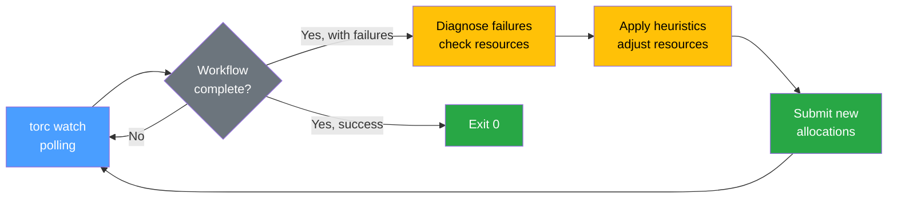

# Automatic Failure Recovery

This guide explains how to use Torc's automatic recovery features to handle workflow failures
without manual intervention.

## Overview

Torc provides **automatic failure recovery** through two commands:

- **`torc recover`** - One-shot recovery for Slurm workflows
- **`torc watch --recover`** - Continuous monitoring with automatic recovery

When jobs fail, the system:

1. Diagnoses the failure cause (OOM, timeout, or unknown)
2. Applies heuristics to adjust resource requirements
3. Resets failed jobs and submits new Slurm allocations
4. (watch only) Resumes monitoring until completion or max retries

This deterministic approach handles the majority of HPC failures without human intervention.

## Why Deterministic Recovery?

Most HPC job failures fall into predictable categories:

| Failure Type     | Frequency | Solution                   |
| ---------------- | --------- | -------------------------- |
| Out of Memory    | ~60%      | Increase memory allocation |
| Timeout          | ~25%      | Increase runtime limit     |
| Transient errors | ~10%      | Simple retry               |
| Code bugs        | ~5%       | Manual intervention        |

For 85-90% of failures, the solution is mechanical: increase resources and retry. This doesn't
require AI judgment—simple heuristics work well.

## Recovery Architecture



### Failure Detection

Torc tracks resource usage during job execution:

- Memory usage (RSS and peak)
- CPU utilization
- Execution time

This data is analyzed to determine failure causes:

**OOM Detection:**

- Peak memory exceeds specified limit
- Exit code 137 (SIGKILL from OOM killer)
- Flag: `likely_oom: true`

**Timeout Detection:**

- Execution time within 10% of runtime limit
- Job was killed (not graceful exit)
- Flag: `likely_timeout: true`

### Recovery Heuristics

| Failure Type  | Detection                          | Default Action           |
| ------------- | ---------------------------------- | ------------------------ |
| Out of Memory | Peak memory > limit, exit code 137 | Increase memory by 1.5x  |
| Timeout       | Execution time near limit          | Increase runtime by 1.5x |
| Unknown       | Other exit codes                   | **Skip** (likely bug)    |

> **Note:** By default, jobs with unknown failure causes are **not** retried, since they likely have
> script or data bugs that won't be fixed by retrying. Use `--retry-unknown` to also retry these
> jobs (e.g., to handle transient errors like network issues).

## The `torc recover` Command

For one-shot recovery when a workflow has failed:

```bash
# Preview what would be done (recommended first step)
torc recover 42 --dry-run

# Execute the recovery
torc recover 42
```

This command:

1. Detects and cleans up orphaned jobs from terminated Slurm allocations
2. Checks that the workflow is complete and no workers are active
3. Diagnoses failure causes (OOM, timeout, etc.)
4. Adjusts resource requirements based on heuristics
5. Runs optional recovery hook for custom logic
6. Resets failed jobs and regenerates Slurm schedulers
7. Submits new allocations

> **Note:** Step 1 (orphan cleanup) handles the case where Slurm terminated an allocation
> unexpectedly, leaving jobs stuck in "running" status. This is done automatically before checking
> preconditions.

### Options

```bash
torc recover <workflow_id> \
  --memory-multiplier 1.5 \     # Memory increase factor for OOM (default: 1.5)
  --runtime-multiplier 1.4 \    # Runtime increase factor for timeout (default: 1.4)
  --retry-unknown \             # Also retry jobs with unknown failure causes
  --recovery-hook "bash fix.sh" \  # Custom script for unknown failures
  --dry-run                     # Preview without making changes
```

### Example Output

```
Diagnosing failures...
Applying recovery heuristics...
  Job 107 (train_model): OOM detected, increasing memory 8g -> 12g
  Applied fixes: 1 OOM, 0 timeout
Resetting 1 job(s) for retry...
  Reset 1 job(s)
Reinitializing workflow...
Regenerating Slurm schedulers...
  Submitted Slurm allocation with 1 job

Recovery complete for workflow 42
  - 1 job(s) had memory increased
Reset 1 job(s). Slurm schedulers regenerated and submitted.
```

## The `torc watch --recover` Command

The `torc watch` command can automatically recover from common failures:

```bash
torc watch 42 --recover
```

This will:

1. Poll the workflow until completion
2. On failure, diagnose the cause (OOM, timeout, etc.)
3. Adjust resource requirements based on heuristics
4. Reset failed jobs and submit new Slurm allocations
5. Resume monitoring
6. Repeat until success or max retries exceeded

### Options

```bash
torc watch <workflow_id> \
  -r \                          # Enable automatic recovery (--recover)
  -m 3 \                        # Maximum recovery attempts (--max-retries)
  --memory-multiplier 1.5 \     # Memory increase factor for OOM
  --runtime-multiplier 1.5 \    # Runtime increase factor for timeout
  --retry-unknown \             # Also retry jobs with unknown failures
  --recovery-hook "bash fix.sh" \  # Custom recovery script
  -p 60 \                       # Seconds between status checks (--poll-interval)
  -o output \                   # Directory for job output files (--output-dir)
  -s \                          # Display job counts during polling (--show-job-counts)
  --auto-schedule \             # Automatically schedule nodes for stranded jobs
  --auto-schedule-threshold 5 \ # Min retry jobs before scheduling (default: 5)
  --auto-schedule-cooldown 1800 \      # Seconds between auto-schedule attempts (default: 1800)
  --auto-schedule-stranded-timeout 7200  # Schedule stranded jobs after this time (default: 7200)
```

### Custom Recovery Hooks

For failures that torc can't handle automatically (not OOM or timeout), you can provide a custom
recovery script using `--recovery-hook`. This is useful for domain-specific recovery logic, such as
adjusting Apache Spark cluster sizes or fixing configuration issues.

```bash
torc watch 42 --recover --recovery-hook "bash fix-spark-cluster.sh"
```

The hook receives the workflow ID in two ways:

- **As an argument**: `bash fix-spark-cluster.sh 42`
- **As an environment variable**: `TORC_WORKFLOW_ID=42`

Your script can use torc CLI commands to query and modify the workflow:

```bash
#!/bin/bash
# fix-spark-cluster.sh - Example recovery hook for Spark jobs

WORKFLOW_ID=$1  # or use $TORC_WORKFLOW_ID

# Find failed jobs
FAILED_JOBS=$(torc jobs list $WORKFLOW_ID --status failed -f json | jq -r '.[].id')

for JOB_ID in $FAILED_JOBS; do
    # Get current resource requirements
    JOB_INFO=$(torc jobs get $JOB_ID -f json)
    RR_ID=$(echo "$JOB_INFO" | jq -r '.resource_requirements_id')

    # Check if this is a Spark job that needs more nodes
    # (your logic here - parse logs, check error messages, etc.)

    # Update resource requirements
    torc resource-requirements update $RR_ID --num-nodes 16

    echo "Updated job $JOB_ID to use 16 nodes"
done
```

When a recovery hook is provided:

1. Jobs with unknown failures are automatically included for retry
2. The hook runs **before** `reset-status` is called
3. If the hook fails (non-zero exit), auto-recovery stops with an error
4. After the hook succeeds, failed jobs are reset and retried

## Auto-Scheduling for Failure Handlers

When using [failure handlers](./failure-handlers.md) that create retry jobs, the originally planned
compute capacity may not be sufficient. The `--auto-schedule` option enables automatic scheduling of
additional Slurm nodes when:

1. **No schedulers available**: If there are ready jobs but no active or pending Slurm allocations,
   new schedulers are immediately regenerated and submitted.

2. **Retry jobs accumulating**: If there are active schedulers but retry jobs (jobs with
   `attempt_id > 1`) are accumulating beyond the threshold, additional schedulers are submitted
   after the cooldown period.

This is particularly useful for workflows with failure handlers that retry failed jobs, ensuring
those retries get scheduled without manual intervention.

### Example: Failure Handler with Auto-Scheduling

```bash
# Submit a workflow with failure handlers
torc submit-slurm --account my_project workflow.yaml

# Watch with auto-scheduling enabled (uses defaults)
torc watch $WORKFLOW_ID --auto-schedule
```

With default settings:

- If all Slurm allocations complete but retry jobs remain, new allocations are submitted
- If 5+ retry jobs accumulate while allocations are running, additional capacity is scheduled
- After scheduling, the system waits 30 minutes before considering another auto-schedule
- If fewer than 5 retry jobs are waiting for 2 hours, they're scheduled anyway (stranded timeout)

## Choosing the Right Command

| Use Case                          | Command                  |
| --------------------------------- | ------------------------ |
| One-shot recovery after failure   | `torc recover`           |
| Continuous monitoring             | `torc watch -r`          |
| Preview what recovery would do    | `torc recover --dry-run` |
| Production long-running workflows | `torc watch -r`          |
| Manual investigation, then retry  | `torc recover`           |

## Complete Workflow Example

### 1. Submit a Workflow

```bash
torc submit-slurm --account myproject workflow.yaml
```

Output:

```
Created workflow 42 with 100 jobs
Submitted to Slurm with 10 allocations
```

### 2. Start Watching with Auto-Recovery

```bash
torc watch 42 --recover --max-retries 3 --show-job-counts
```

> **Note:** The `--show-job-counts` flag is optional. Without it, the command polls silently until
> completion, which reduces server load for large workflows.

Output:

```
Watching workflow 42 (poll interval: 60s, recover enabled, max retries: 3, job counts enabled)
  completed=0, running=10, pending=0, failed=0, blocked=90
  completed=25, running=10, pending=0, failed=0, blocked=65
  ...
  completed=95, running=0, pending=0, failed=5, blocked=0
Workflow 42 is complete

Workflow completed with failures:
  - Failed: 5
  - Canceled: 0
  - Terminated: 0
  - Completed: 95

Attempting automatic recovery (attempt 1/3)

Diagnosing failures...
Applying recovery heuristics...
  Job 107 (train_model_7): OOM detected, increasing memory 8g -> 12g
  Job 112 (train_model_12): OOM detected, increasing memory 8g -> 12g
  Job 123 (train_model_23): OOM detected, increasing memory 8g -> 12g
  Job 131 (train_model_31): OOM detected, increasing memory 8g -> 12g
  Job 145 (train_model_45): OOM detected, increasing memory 8g -> 12g
  Applied fixes: 5 OOM, 0 timeout

Resetting failed jobs...
Regenerating Slurm schedulers and submitting...

Recovery initiated. Resuming monitoring...

Watching workflow 42 (poll interval: 60s, recover enabled, max retries: 3, job counts enabled)
  completed=95, running=5, pending=0, failed=0, blocked=0
  ...
Workflow 42 is complete

Workflow completed successfully (100 jobs)
```

### 3. If No Recoverable Jobs Found

If all failures are from unknown causes (not OOM or timeout):

```
Applying recovery heuristics...
  2 job(s) with unknown failure cause (skipped, use --retry-unknown to include)

No recoverable jobs found. 2 job(s) failed with unknown causes.
Use --retry-unknown to retry jobs with unknown failure causes.
Or use the Torc MCP server with your AI assistant to investigate.
```

This prevents wasting allocation time on jobs that likely have script or data bugs.

### 4. If Max Retries Exceeded

If failures persist after max retries:

```
Max retries (3) exceeded. Manual intervention required.
Use the Torc MCP server with your AI assistant to investigate.
```

At this point, you can use the MCP server with an AI assistant to investigate the root cause.

## Log Files

All `torc watch` output is logged to both the terminal and a log file:

```
<output-dir>/watch_<hostname>_<workflow_id>.log
```

For example: `output/watch_myhost_42.log`

This ensures you have a complete record of the watch session even if your terminal disconnects.

## When to Use Manual Recovery

Automatic recovery works well for resource-related failures, but some situations require manual
intervention:

### Use Manual Recovery When:

1. **Jobs keep failing after max retries**
   - The heuristics aren't solving the problem
   - Need to investigate root cause

2. **Unknown failure modes**
   - Exit codes that don't indicate OOM/timeout
   - Application-specific errors

3. **Code bugs**
   - Jobs fail consistently with same error
   - No resource issue detected

4. **Cost optimization**
   - Want to analyze actual usage before increasing
   - Need to decide whether job is worth more resources

### MCP Server for Manual Recovery

The Torc MCP server provides tools for AI-assisted investigation:

| Tool                         | Purpose                          |
| ---------------------------- | -------------------------------- |
| `get_workflow_status`        | Get overall workflow status      |
| `list_failed_jobs`           | List failed jobs with error info |
| `get_job_logs`               | Read stdout/stderr logs          |
| `check_resource_utilization` | Detailed resource analysis       |
| `update_job_resources`       | Manually adjust resources        |
| `resubmit_workflow`          | Regenerate Slurm schedulers      |

## Best Practices

### 1. Start with Conservative Resources

Set initial resource requests lower and let auto-recovery increase them:

- Jobs that succeed keep their original allocation
- Only failing jobs get increased resources
- Avoids wasting HPC resources on over-provisioned jobs

### 2. Set Reasonable Max Retries

```bash
--max-retries 3  # Good for most workflows
```

Too many retries can waste allocation time on jobs that will never succeed.

### 3. Use Appropriate Multipliers

For memory-bound jobs:

```bash
--memory-multiplier 2.0  # Double on OOM
```

For time-sensitive jobs where you want larger increases:

```bash
--runtime-multiplier 2.0  # Double runtime on timeout
```

### 4. Run in tmux or screen

**Always run `torc watch` inside tmux or screen** for long-running workflows. HPC workflows can run
for hours or days, and you don't want to lose your monitoring session if:

- Your SSH connection drops
- Your laptop goes to sleep
- You need to disconnect and reconnect later

Using [tmux](https://github.com/tmux/tmux/wiki) (recommended):

```bash
# Start a new tmux session
tmux new -s torc-watch

# Run the watch command
torc watch 42 --recover --poll-interval 300 --show-job-counts

# Detach from session: press Ctrl+b, then d
# Reattach later: tmux attach -t torc-watch
```

Using screen:

```bash
screen -S torc-watch
torc watch 42 --recover --poll-interval 300 --show-job-counts
# Detach: Ctrl+a, then d
# Reattach: screen -r torc-watch
```

### 5. Check Resource Utilization Afterward

After completion, review actual usage:

```bash
torc reports check-resource-utilization 42
```

This helps tune future job specifications.

## Troubleshooting

### Jobs Stuck in "Running" Status

If jobs appear stuck in "running" status after a Slurm allocation ended:

1. This usually means the allocation was terminated unexpectedly (timeout, node failure, etc.)
2. The `torc recover` command automatically handles this as its first step
3. To manually clean up without triggering recovery, use:
   ```bash
   torc workflows sync-status <workflow_id>
   ```
4. To preview what would be cleaned up:
   ```bash
   torc workflows sync-status <workflow_id> --dry-run
   ```

See [Debugging Slurm Workflows](../hpc/debugging-slurm.md#orphaned-jobs-and-status-synchronization)
for more details.

### Jobs Keep Failing After Recovery

If jobs fail repeatedly with the same error:

1. Check if the error is resource-related (OOM/timeout)
2. Review job logs: `torc jobs logs <job_id>`
3. Check if there's a code bug
4. Use MCP server with AI assistant to investigate

### No Slurm Schedulers Generated

If `slurm regenerate` fails:

1. Ensure workflow was created with `--account` option
2. Check HPC profile is detected: `torc hpc detect`
3. Specify profile explicitly: `--profile kestrel`

### Resource Limits Too High

If jobs are requesting more resources than partitions allow:

1. Check partition limits: `torc hpc partitions <profile>`
2. Use smaller multipliers
3. Consider splitting jobs into smaller pieces

## Comparison: Automatic vs Manual Recovery

| Feature                | Automatic            | Manual/AI-Assisted      |
| ---------------------- | -------------------- | ----------------------- |
| Human involvement      | None                 | Interactive             |
| Speed                  | Fast                 | Depends on human        |
| Handles OOM/timeout    | Yes                  | Yes                     |
| Handles unknown errors | Retry only           | Full investigation      |
| Cost optimization      | Basic                | Can be sophisticated    |
| Use case               | Production workflows | Debugging, optimization |

## Implementation Details

### The Watch Command Flow

1. Poll `is_workflow_complete` API
2. Print status updates
3. On completion, check for failures
4. If failures and recover enabled:
   - Run `torc reports check-resource-utilization --include-failed`
   - Parse results for `likely_oom` and `likely_timeout` flags
   - Update resource requirements via API
   - Run `torc workflows reset-status --failed-only --reinitialize`
   - Run `torc slurm regenerate --submit`
   - Increment retry counter
   - Resume polling
5. Exit 0 on success, exit 1 on max retries exceeded

### The Regenerate Command Flow

1. Query jobs with status uninitialized/ready/blocked
2. Group by resource requirements
3. For each group:
   - Find best partition using HPC profile
   - Calculate jobs per node
   - Determine number of allocations needed
   - Create scheduler config
4. Update jobs with new scheduler reference
5. Submit allocations via sbatch

## See Also

- [Configurable Failure Handlers](./failure-handlers.md) - Per-job retry with exit-code-specific
  recovery
- [Resource Monitoring](../../core/monitoring/resource-monitoring.md) - Understanding resource
  tracking
