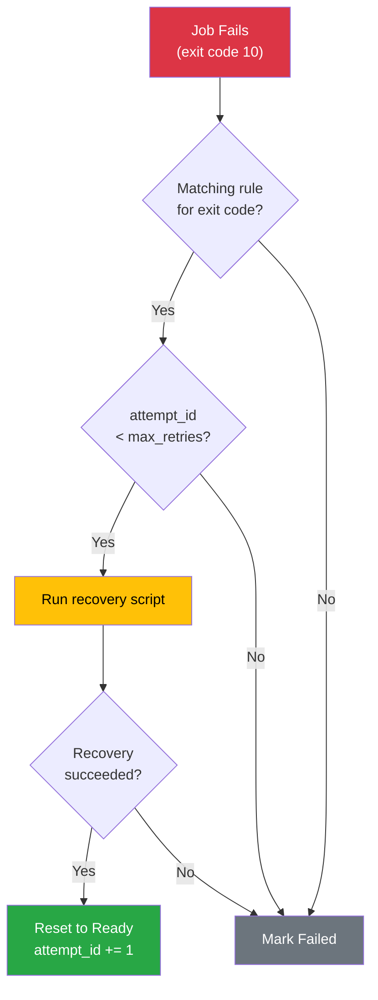

# Tutorial: Configurable Failure Handlers

This tutorial shows how to configure automatic job retry based on specific exit codes, with optional
recovery scripts.

## Learning Objectives

By the end of this tutorial, you will:

- Understand failure handlers and rules
- Configure exit-code-specific recovery
- Write recovery scripts
- Monitor retry attempts

## Prerequisites

- Torc installed with the client feature
- A running Torc server

## What Are Failure Handlers?

Failure handlers provide per-job automatic retry logic based on exit codes. Unlike
`torc watch --recover` which applies workflow-level recovery heuristics, failure handlers let you
define:

- **Exit codes to match**: Which return codes trigger recovery
- **Recovery scripts**: Optional scripts to run before retry
- **Max retries**: How many times to retry per exit code

## Quick Start

Try the runnable demo:

```bash
torc run examples/yaml/failure_handler_demo.yaml
```

This workflow includes jobs that randomly fail with different exit codes, demonstrating how failure
handlers automatically retry them.

## Basic Example

Create a workflow with a failure handler:

```yaml
failure_handlers:
  - name: job_recovery
    rules:
      - exit_codes: [10, 11, 12]
        recovery_script: ./recovery.sh
        max_retries: 3

jobs:
  - name: process_data
    command: python process.py
    failure_handler: job_recovery
```

## How It Works

When a job with a failure handler fails:

1. JobRunner checks the exit code against handler rules
2. If a matching rule is found and `attempt_id < max_retries`:
   - Run recovery_script (if defined) with environment variables
   - If recovery succeeds: job is reset to Ready with incremented attempt_id
   - If recovery fails: job is marked as Failed
3. If no match or max retries exceeded: job is marked as Failed



## Environment Variables

Recovery scripts receive the following environment variables:

| Variable         | Description                       |
| ---------------- | --------------------------------- |
| TORC_WORKFLOW_ID | Workflow ID                       |
| TORC_JOB_ID      | Job ID                            |
| TORC_JOB_NAME    | Job name                          |
| TORC_API_URL     | Server URL                        |
| TORC_OUTPUT_DIR  | Output directory                  |
| TORC_ATTEMPT_ID  | Current attempt (1, 2, 3...)      |
| TORC_RETURN_CODE | Exit code that triggered recovery |

Jobs also receive these environment variables during execution:

| Variable         | Description                   |
| ---------------- | ----------------------------- |
| TORC_WORKFLOW_ID | Workflow ID                   |
| TORC_JOB_ID      | Job ID                        |
| TORC_JOB_NAME    | Job name                      |
| TORC_API_URL     | Server URL                    |
| TORC_OUTPUT_DIR  | Output directory              |
| TORC_ATTEMPT_ID  | Current attempt (starts at 1) |

## Writing Recovery Scripts

Example recovery script:

```bash
#!/bin/bash
# recovery.sh - Run before retrying a failed job

echo "=== Recovery Script ==="
echo "Job: $TORC_JOB_NAME (attempt $TORC_ATTEMPT_ID)"
echo "Failed with exit code: $TORC_RETURN_CODE"

# Log the recovery attempt
LOG_FILE="$TORC_OUTPUT_DIR/recovery.log"
echo "$(date): Recovery for $TORC_JOB_NAME (exit $TORC_RETURN_CODE)" >> "$LOG_FILE"

# Take action based on exit code
case $TORC_RETURN_CODE in
    10)
        echo "Handling convergence error - adjusting parameters"
        # Modify config files, adjust parameters, etc.
        ;;
    11)
        echo "Handling resource error - cleaning up"
        # Free resources, clean temp files, etc.
        ;;
    12)
        echo "Handling transient error - no action needed"
        ;;
esac

exit 0  # Zero = proceed with retry
```

Make sure your script is executable:

```bash
chmod +x recovery.sh
```

## Multiple Rules

Handle different exit codes with different strategies:

```yaml
failure_handlers:
  - name: comprehensive_recovery
    rules:
      # Convergence errors: adjust parameters
      - exit_codes: [10]
        recovery_script: ./adjust_params.sh
        max_retries: 3

      # Resource errors: clean up and retry
      - exit_codes: [11]
        recovery_script: ./cleanup.sh
        max_retries: 2

      # Transient errors: simple retry
      - exit_codes: [12]
        max_retries: 3

      # Exit code 1 is NOT listed - jobs with exit 1 won't retry
```

## Shared Handlers

Multiple jobs can share a failure handler:

```yaml
failure_handlers:
  - name: simulation_recovery
    rules:
      - exit_codes: [10, 11, 12]
        recovery_script: ./recovery.sh
        max_retries: 3

jobs:
  - name: simulation_1
    command: python simulate.py --config config1.yaml
    failure_handler: simulation_recovery

  - name: simulation_2
    command: python simulate.py --config config2.yaml
    failure_handler: simulation_recovery
```

## Simple Retry for Any Failure

For jobs that are simply flaky and need retrying on any failure, use `match_all_exit_codes`:

```yaml
failure_handlers:
  - name: simple_retry
    rules:
      - match_all_exit_codes: true
        max_retries: 3

jobs:
  - name: flaky_job
    command: ./flaky_script.sh
    failure_handler: simple_retry
```

This retries the job up to 3 times on any non-zero exit code, without running a recovery script.

You can also combine `match_all_exit_codes` with specific exit code rules. Rules are evaluated in
order, so put specific rules first:

```yaml
failure_handlers:
  - name: mixed_recovery
    rules:
      # Specific handling for known error codes
      - exit_codes: [10]
        recovery_script: ./fix_convergence.sh
        max_retries: 3

      # Catch-all for any other failures
      - match_all_exit_codes: true
        max_retries: 2
```

## Log Files

Each attempt gets separate log files, preserving history across retries:

```
output/job_stdio/job_wf1_j42_r1_a1.o  # Attempt 1 stdout
output/job_stdio/job_wf1_j42_r1_a1.e  # Attempt 1 stderr
output/job_stdio/job_wf1_j42_r1_a2.o  # Attempt 2 stdout
output/job_stdio/job_wf1_j42_r1_a2.e  # Attempt 2 stderr
```

The `a{N}` suffix indicates the attempt number.

## Comparison with `torc watch --recover`

| Feature           | Failure Handlers            | `torc watch --recover`   |
| ----------------- | --------------------------- | ------------------------ |
| **Scope**         | Per-job, exit-code-specific | Workflow-wide            |
| **Triggers**      | Specific exit codes         | OOM, timeout detection   |
| **Recovery**      | Custom scripts              | Resource adjustment      |
| **Timing**        | Immediate (during run)      | After workflow completes |
| **Configuration** | In workflow spec            | Command-line options     |

**Use both together for comprehensive recovery:**

- Failure handlers for immediate, exit-code-specific retry
- `torc watch --recover` for workflow-level resource adjustments

## Slurm Integration with `--auto-schedule`

When using failure handlers with Slurm workflows, retried jobs need compute nodes to run on. The
original Slurm allocations may have already completed or may not have enough capacity for the
retries.

Use `torc watch --auto-schedule` to automatically submit new Slurm allocations when retry jobs are
waiting:

```bash
# Submit a workflow with failure handlers
torc submit-slurm --account my_project workflow.yaml

# Watch with auto-scheduling enabled (uses defaults)
torc watch $WORKFLOW_ID --auto-schedule
```

### How It Works

1. **No schedulers available**: If there are ready jobs but no active or pending Slurm allocations,
   new schedulers are immediately regenerated and submitted.

2. **Retry jobs accumulating**: If there are active schedulers but retry jobs (jobs with
   `attempt_id > 1`) exceed the threshold, additional schedulers are submitted after the cooldown
   period.

3. **Stranded jobs**: If retry jobs exist but are below the threshold and have been waiting longer
   than the stranded timeout, schedulers are submitted anyway. This prevents jobs from being
   stranded indefinitely when not enough failures occur to reach the threshold.

### Options

| Option                             | Default | Description                                            |
| ---------------------------------- | ------- | ------------------------------------------------------ |
| `--auto-schedule`                  | false   | Enable automatic scheduling for stranded jobs          |
| `--auto-schedule-threshold`        | 5       | Minimum retry jobs before scheduling (when active)     |
| `--auto-schedule-cooldown`         | 1800    | Seconds between auto-schedule attempts (30 min)        |
| `--auto-schedule-stranded-timeout` | 7200    | Seconds before scheduling stranded jobs anyway (2 hrs) |

### Example Scenario

```
Workflow starts with 100 jobs across 10 Slurm allocations

Jobs 15, 23, 47 fail with exit code 10 → failure handler retries them
  → Jobs reset to Ready with attempt_id=2

All 10 allocations finish (97 jobs completed)

torc watch detects:
  - No active schedulers
  - 3 ready jobs (all retries)
  → Auto-schedules new allocation

New allocation starts, runs the 3 retry jobs
  → Job 15 succeeds
  → Jobs 23, 47 fail again → retry with attempt_id=3

Process continues until all jobs succeed or max_retries exceeded
```

## Complete Example

Here's a complete workflow specification with failure handlers. See
`examples/yaml/failure_handler_simulation.yaml` for the full runnable example.

```yaml
name: failure_handler_simulation
description: Simulation sweep with automatic failure recovery

failure_handlers:
  - name: simulation_recovery
    rules:
      # Convergence issues: run recovery script, retry up to 3 times
      - exit_codes: [10]
        recovery_script: examples/scripts/recovery_demo.sh
        max_retries: 3

      # Resource issues: run recovery script, retry up to 2 times
      - exit_codes: [11]
        recovery_script: examples/scripts/recovery_demo.sh
        max_retries: 2

      # Transient errors: simple retry, no recovery script
      - exit_codes: [12]
        max_retries: 3

      # Note: exit code 1 is intentionally NOT included (unrecoverable)

jobs:
  # Parameterized jobs that may fail with different error codes
  - name: simulate_m{model}_s{scenario}
    command: bash examples/scripts/failure_demo_job.sh --fail-rate 0.7
    failure_handler: simulation_recovery
    parameters:
      model: "0:2"
      scenario: "0:2"

  # Runs after all simulations complete
  - name: aggregate_results
    command: echo "All simulations completed successfully!"
    depends_on:
      - simulate_m{model}_s{scenario}
    parameters:
      model: "0:2"
      scenario: "0:2"
```

Run this example with:

```bash
torc run examples/yaml/failure_handler_simulation.yaml
```

## Tips and Best Practices

### 1. Use Exit Codes Consistently

Define meaningful exit codes in your scripts:

```python
# simulate.py
import sys

try:
    # Simulation code
    pass
except ConvergenceError:
    sys.exit(10)  # Will trigger recovery
except ResourceError:
    sys.exit(11)  # Will trigger recovery
except TransientError:
    sys.exit(12)  # Will trigger recovery
except Exception as e:
    print(f"Unrecoverable error: {e}")
    sys.exit(1)   # Will NOT trigger recovery
```

### 2. Keep Recovery Scripts Simple

Recovery scripts should be quick and focused:

```bash
# Good: Simple, focused recovery
#!/bin/bash
echo "Cleaning up before retry..."
rm -f /tmp/lockfile
exit 0

# Avoid: Complex logic that might fail
```

### 3. Set Reasonable Max Retries

```yaml
rules:
  - exit_codes: [10]
    max_retries: 3 # Good for transient errors

  - exit_codes: [1]
    max_retries: 1 # Generic errors - don't retry many times
```

### 4. Log Recovery Actions

Your recovery scripts should log what they're doing:

```bash
#!/bin/bash
LOG_FILE="$TORC_OUTPUT_DIR/recovery_${TORC_JOB_ID}.log"
echo "$(date): Recovery attempt $TORC_ATTEMPT_ID for exit code $TORC_RETURN_CODE" >> "$LOG_FILE"
```

## Troubleshooting

### Recovery Script Not Running

1. Check that the script is executable: `chmod +x script.sh`
2. Verify the script path is correct (relative to where torc runs)
3. Check that the exit code matches a rule

### Job Keeps Failing After Max Retries

1. Check the job logs for all attempts
2. Review the recovery script output
3. Consider increasing `max_retries` or fixing the underlying issue

### Environment Variables Not Set

Ensure you're accessing the variables correctly:

```bash
# Correct
echo $TORC_JOB_ID

# Also correct
echo ${TORC_JOB_ID}
```

## Runnable Examples

The following examples are included with Torc and can be run directly:

- **Simple demo**: `examples/yaml/failure_handler_demo.yaml`
- **Parameterized simulation**: `examples/yaml/failure_handler_simulation.yaml`

These examples use:

- `examples/scripts/failure_demo_job.sh` - A bash script that randomly fails with different exit
  codes
- `examples/scripts/recovery_demo.sh` - A recovery script that logs actions

## Summary

Failure handlers provide fine-grained control over job retry behavior:

- **Define rules** for specific exit codes
- **Run recovery scripts** before retry
- **Limit retries** to prevent infinite loops
- **Share handlers** across multiple jobs

Use failure handlers for immediate, exit-code-specific recovery, and combine with
`torc watch --recover` for comprehensive workflow resilience.
