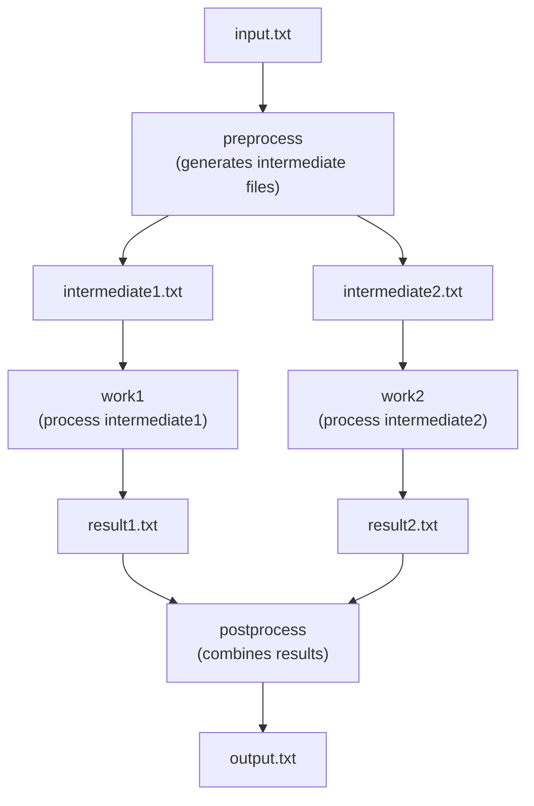

# Tutorial 2: Diamond Workflow with File Dependencies

This tutorial teaches you how to create workflows where job dependencies are automatically inferred from file inputs and outputs—a core concept in Torc called **implicit dependencies**.

## Learning Objectives

By the end of this tutorial, you will:

- Understand how Torc infers job dependencies from file relationships
- Learn the "diamond" workflow pattern (fan-out and fan-in)
- Know how to use file variable substitution (`${files.input.*}` and `${files.output.*}`)
- See how jobs automatically unblock when their input files become available

## Prerequisites

- Completed [Tutorial 1: Many Independent Jobs](./many-jobs.md)
- Torc server running

## The Diamond Pattern

The "diamond" pattern is a common workflow structure where:
1. One job produces multiple outputs (fan-out)
2. Multiple jobs process those outputs in parallel
3. A final job combines all results (fan-in)



Notice that we never explicitly say "work1 depends on preprocess"—Torc figures this out automatically because `work1` needs `intermediate1.txt` as input, and `preprocess` produces it as output.

## Step 1: Create the Workflow Specification

Save as `diamond.yaml`:

```yaml
name: diamond_workflow
description: Diamond workflow demonstrating fan-out and fan-in

jobs:
  - name: preprocess
    command: |
      cat ${files.input.input_file} |
      awk '{print $1}' > ${files.output.intermediate1}
      cat ${files.input.input_file} |
      awk '{print $2}' > ${files.output.intermediate2}
    resource_requirements: small

  - name: work1
    command: |
      cat ${files.input.intermediate1} |
      sort | uniq > ${files.output.result1}
    resource_requirements: medium

  - name: work2
    command: |
      cat ${files.input.intermediate2} |
      sort | uniq > ${files.output.result2}
    resource_requirements: medium

  - name: postprocess
    command: |
      paste ${files.input.result1} ${files.input.result2} > ${files.output.final_output}
    resource_requirements: small

files:
  - name: input_file
    path: /tmp/input.txt

  - name: intermediate1
    path: /tmp/intermediate1.txt

  - name: intermediate2
    path: /tmp/intermediate2.txt

  - name: result1
    path: /tmp/result1.txt

  - name: result2
    path: /tmp/result2.txt

  - name: final_output
    path: /tmp/output.txt

resource_requirements:
  - name: small
    num_cpus: 1
    num_gpus: 0
    num_nodes: 1
    memory: 1g
    runtime: PT10M

  - name: medium
    num_cpus: 4
    num_gpus: 0
    num_nodes: 1
    memory: 4g
    runtime: PT30M
```

### Understanding File Variable Substitution

The key concept here is **file variable substitution**:

- **`${files.input.filename}`** - References a file this job reads (creates a dependency)
- **`${files.output.filename}`** - References a file this job writes (satisfies dependencies)

When Torc processes the workflow:
1. It sees `preprocess` outputs `intermediate1` and `intermediate2`
2. It sees `work1` inputs `intermediate1` → dependency created
3. It sees `work2` inputs `intermediate2` → dependency created
4. It sees `postprocess` inputs `result1` and `result2` → dependencies created

This is more maintainable than explicit `depends_on` declarations because:
- Dependencies are derived from actual data flow
- Adding a new intermediate step automatically updates dependencies
- The workflow specification documents the data flow

## Step 2: Create Input Data

```bash
# Create test input file
echo -e "apple red\nbanana yellow\ncherry red\ndate brown" > /tmp/input.txt
```

## Step 3: Create and Initialize the Workflow

```bash
# Create the workflow and capture the ID
WORKFLOW_ID=$(torc workflows create diamond.yaml -f json | jq -r '.id')
echo "Created workflow: $WORKFLOW_ID"

# Ensure the input file timestamp is current
touch /tmp/input.txt

# Initialize the workflow (builds dependency graph)
torc workflows initialize-jobs $WORKFLOW_ID
```

The `initialize-jobs` command is where Torc:
1. Analyzes file input/output relationships
2. Builds the dependency graph
3. Marks jobs with satisfied dependencies as "ready"

## Step 4: Observe Dependency Resolution

```bash
# Check job statuses
torc jobs list $WORKFLOW_ID
```

Expected output:
```
╭────┬──────────────┬─────────┬────────╮
│ ID │ Name         │ Status  │ ...    │
├────┼──────────────┼─────────┼────────┤
│ 1  │ preprocess   │ ready   │ ...    │
│ 2  │ work1        │ blocked │ ...    │
│ 3  │ work2        │ blocked │ ...    │
│ 4  │ postprocess  │ blocked │ ...    │
╰────┴──────────────┴─────────┴────────╯
```

Only `preprocess` is ready because:
- Its only input (`input_file`) already exists
- The others are blocked waiting for files that don't exist yet

## Step 5: Run the Workflow

```console
torc run $WORKFLOW_ID
```

Watch the execution unfold:

1. **`preprocess` runs first** - Creates `intermediate1.txt` and `intermediate2.txt`
2. **`work1` and `work2` unblock** - Their input files now exist
3. **`work1` and `work2` run in parallel** - They have no dependency on each other
4. **`postprocess` unblocks** - Both `result1.txt` and `result2.txt` exist
5. **`postprocess` runs** - Creates the final output

## Step 6: Verify Results

```console
cat /tmp/output.txt
```

You should see the combined, sorted, unique values from both columns of the input.

## How Implicit Dependencies Work

Torc determines job order through file relationships:

| Job | Inputs | Outputs | Blocked By |
|-----|--------|---------|------------|
| preprocess | input_file | intermediate1, intermediate2 | (nothing) |
| work1 | intermediate1 | result1 | preprocess |
| work2 | intermediate2 | result2 | preprocess |
| postprocess | result1, result2 | final_output | work1, work2 |

The dependency graph is built automatically from these relationships. If you later add a validation step between `preprocess` and `work1`, you only need to update the file references—the dependencies adjust automatically.

## What You Learned

In this tutorial, you learned:

- ✅ How to define files with `files:` section and reference them in jobs
- ✅ How `${files.input.*}` creates implicit dependencies
- ✅ How `${files.output.*}` satisfies dependencies for downstream jobs
- ✅ The diamond pattern: fan-out → parallel processing → fan-in
- ✅ How Torc automatically determines execution order from data flow

## When to Use File Dependencies vs Explicit Dependencies

**Use file dependencies when:**
- Jobs actually read/write files
- Data flow defines the natural ordering
- You want self-documenting workflows

**Use explicit `depends_on` when:**
- Dependencies are logical, not data-based
- Jobs communicate through side effects
- You need precise control over ordering

## Example Files

See the diamond workflow examples in all three formats:
- [diamond_workflow.yaml](https://github.com/NREL/torc/blob/main/examples/yaml/diamond_workflow.yaml)
- [diamond_workflow.json5](https://github.com/NREL/torc/blob/main/examples/json/diamond_workflow.json5)
- [diamond_workflow.kdl](https://github.com/NREL/torc/blob/main/examples/kdl/diamond_workflow.kdl)

A Python version is also available: [diamond_workflow.py](https://github.com/NREL/torc/blob/main/examples/python/diamond_workflow.py)

## Next Steps

- [Tutorial 3: User Data Dependencies](./user-data.md) - Pass JSON data between jobs without files
- [Tutorial 4: Simple Parameterization](./simple-params.md) - Combine file dependencies with parameter expansion
