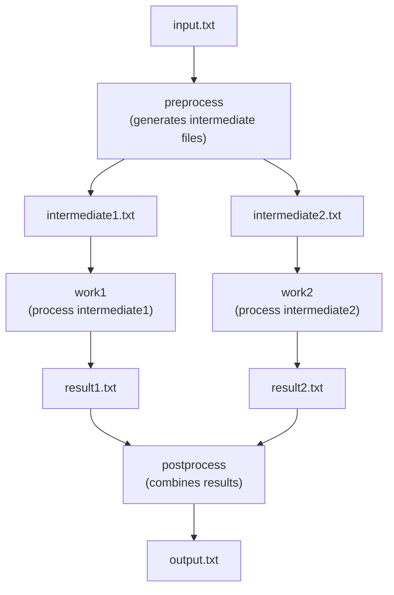

# Tutorial 2: Diamond Workflow with File Dependencies

**Goal**: Create a workflow where job dependencies are inferred from file inputs/outputs.

**Workflow Structure**:


## Step 1: Create Workflow Specification

Save as `diamond.yaml`:

```yaml
name: diamond_workflow
user: myuser
description: Diamond workflow demonstrating fan-out and fan-in

jobs:
  - name: preprocess
    command: |
      cat ${files.input.input_file} |
      awk '{print $1}' > ${files.output.intermediate1}
      cat ${files.input.input_file} |
      awk '{print $2}' > ${files.output.intermediate2}
    resource_requirements_name: small

  - name: work1
    command: |
      cat ${files.input.intermediate1} |
      sort | uniq > ${files.output.result1}
    resource_requirements_name: medium

  - name: work2
    command: |
      cat ${files.input.intermediate2} |
      sort | uniq > ${files.output.result2}
    resource_requirements_name: medium

  - name: postprocess
    command: |
      paste ${files.input.result1} ${files.input.result2} > ${files.output.final_output}
    resource_requirements_name: small

files:
  - name: input_file
    path: /tmp/input.txt

  - name: intermediate1
    path: /tmp/intermediate1.txt

  - name: intermediate2
    path: /tmp/intermediate2.txt

  - name: result1
    path: /tmp/result1.txt

  - name: result2
    path: /tmp/result2.txt

  - name: final_output
    path: /tmp/output.txt

resource_requirements:
  - name: small
    num_cpus: 1
    num_gpus: 0
    num_nodes: 1
    memory: 1g
    runtime: PT10M

  - name: medium
    num_cpus: 4
    num_gpus: 0
    num_nodes: 1
    memory: 4g
    runtime: PT30M
```

## Step 2: Create Input Data

```bash
# Create test input file
echo -e "apple red\nbanana yellow\ncherry red\ndate brown" > /tmp/input.txt
```

## Step 3: Create and Initialize Workflow

```bash
WORKFLOW_ID=$(torc-client workflows create-from-spec diamond.yaml | jq -r '.id')

# Update input file timestamp so it's "ready"
touch /tmp/input.txt

# Initialize workflow
torc-client workflows initialize-jobs $WORKFLOW_ID
```

## Step 4: Observe Dependency Resolution

```bash
# Check job statuses
torc-client jobs list $WORKFLOW_ID | jq '.jobs[] | {name, status}'
```

Expected output:
```json
{"name": "preprocess", "status": "ready"}
{"name": "work1", "status": "blocked"}
{"name": "work2", "status": "blocked"}
{"name": "postprocess", "status": "blocked"}
```

Only `preprocess` is ready because it has no dependencies. The others are blocked waiting for their input files.

## Step 5: Run Workflow

```bash
torc-job-runner $WORKFLOW_ID
```

Watch the execution:
1. `preprocess` runs first, creates intermediate files
2. `work1` and `work2` become ready and run in parallel
3. `postprocess` becomes ready after both workers complete
4. `postprocess` runs and creates final output

## Step 6: Verify Results

```bash
cat /tmp/output.txt
```
